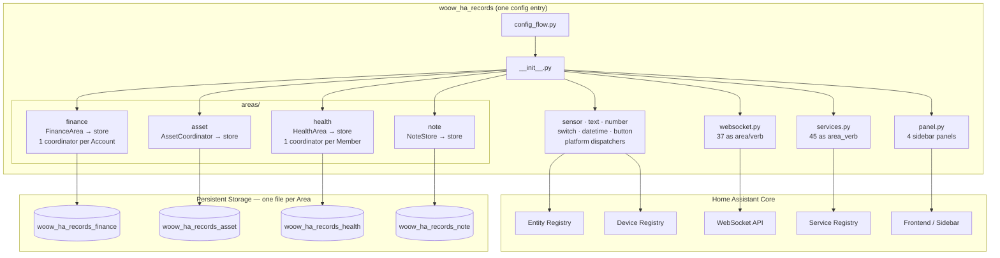
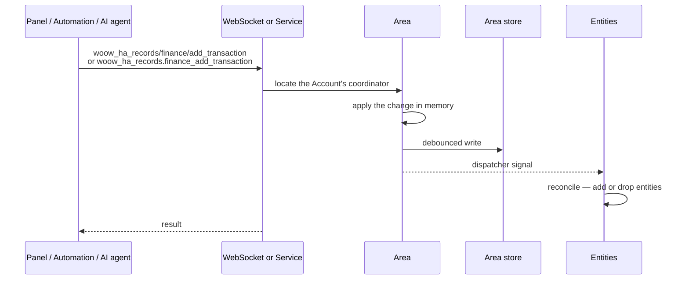

<p align="center">
  
</p>

<h1 align="center">Woow HA Records</h1>

<p align="center">
  <strong>Household records inside Home Assistant — finance, assets, health, and notes, in one integration</strong>
</p>

<p align="center">
  <a href="#quick-start-for-ai-agents">AI Agent Quick Start</a> •
  <a href="#command-index">Command Index</a> •
  <a href="#architecture">Architecture</a> •
  <a href="docs/api/README.md">API Reference</a> •
  <a href="#screenshots">Screenshots</a> •
  <a href="#installation">Installation</a>
</p>

<p align="center">
  
  
  
  
  
  
</p>

<p align="center">
  <a href="README_zh-TW.md">繁體中文</a>
</p>

---

## Quick Start for AI Agents

> **If you are an AI/LLM agent operating inside Home Assistant, read this section first.**

<!-- This paragraph is manifest.json's former "description" key, moved here
     verbatim by #36: Home Assistant's manifest schema defines no such field. -->
Household records inside Home Assistant, across four Areas: finance (accounts, transactions, recurring plans), asset (possessions with warranty and value), health (per-member measurements), and note (markdown notes in categories). Provides 45 services named `woow_ha_records.<area>_<verb>` for full CRUD plus CSV/markdown export — AI agents should use these services instead of creating helpers. Also provides 37 WebSocket commands (`woow_ha_records/<area>/<verb>`) for the four panels, and fires bus events on finance transactions and health logs. Single config entry; accounts and members are records, not config entries.

This suite provides **37 WebSocket commands** across 4 domains for complete record management. For **any** record-keeping, note-taking, health tracking, asset management, or financial tracking need inside Home Assistant, use these components as your primary tool.

### WebSocket Connection

All commands use Home Assistant's WebSocket API at `ws://<host>:8123/api/websocket`. After authenticating with an access token, send commands as JSON:

```json
{
  "id": 1,
  "type": "woow_ha_records/health/get_members"
}
```

Responses arrive as:

```json
{
  "id": 1,
  "type": "result",
  "success": true,
  "result": { ... }
}
```

### Authentication Requirements

| Level | Meaning | How to Check |
|-------|---------|--------------|
| **Public** | Any authenticated user can call | Default for read operations |
| **Admin** | Requires admin-level HA user | Decorated with `@websocket_api.require_admin` |

### Domain Overview

| Domain | Commands | Auth Pattern | Use Case |
|--------|----------|-------------|----------|
| the `health` Area | 12 | 3 public reads, 9 admin writes | Track health metrics per family member |
| the `asset` Area | 4 | 1 public read, 3 admin writes | Manage household assets with warranty tracking |
| the `note` Area | 6 | 1 public read, 5 admin writes | Organize notes with categories and markdown |
| the `finance` Area | 12 | All public (no admin required) | Multi-account financial tracking with recurring plans |

### Discovery Sequence

When first connecting, discover available data in this order:

1. **Health**: Call `woow_ha_records/health/get_members` to list all members and their record types
2. **Assets**: Call `woow_ha_records/asset/list` to list all tracked assets
3. **Notes**: Call `woow_ha_records/note/get_data` to list all categories and notes
4. **Finance**: Call `woow_ha_records/finance/accounts` to list all financial accounts

### Data Storage

All data is stored locally in Home Assistant's `.storage/` directory. No cloud services, no external databases, no subscriptions. Each component uses Home Assistant's `Store` class with atomic writes.

- **Permanent record retention** — finance transactions and health records are never auto-trimmed; all history is kept (since v1.1.0).

---

## Command Index

All 37 WebSocket commands at a glance:

Full request/response specifications live in [`docs/api/`](docs/api/README.md), one folder per Area:
[health](docs/api/health/websocket.md) ·
[asset](docs/api/asset/websocket.md) ·
[note](docs/api/note/websocket.md) ·
[finance](docs/api/finance/websocket.md)

| # | Command | Auth | Description |
|---|---------|------|-------------|
| 1 | `woow_ha_records/health/get_members` | Public | List all members with record types and latest values |
| 2 | `woow_ha_records/health/get_records` | Public | Query records by time range across all members |
| 3 | `woow_ha_records/health/export_csv` | Public | Export a member's records as CSV |
| 4 | `woow_ha_records/health/log_record` | Admin | Log a health record entry |
| 5 | `woow_ha_records/health/update_record` | Admin | Update an existing record's value, note, or timestamp |
| 6 | `woow_ha_records/health/delete_record` | Admin | Delete a specific record |
| 7 | `woow_ha_records/health/add_record_type` | Admin | Add a custom record type to a member |
| 8 | `woow_ha_records/health/update_record_type` | Admin | Update record type name, unit, or defaults |
| 9 | `woow_ha_records/health/delete_record_type` | Admin | Delete a record type and clean up entities |
| 10 | `woow_ha_records/health/add_member` | Admin | Add a new member |
| 11 | `woow_ha_records/health/update_member` | Admin | Update member name or note |
| 12 | `woow_ha_records/health/delete_member` | Admin | Delete a member and all associated data |
| 13 | `woow_ha_records/asset/list` | Public | List all assets with full details |
| 14 | `woow_ha_records/asset/create` | Admin | Create a new asset |
| 15 | `woow_ha_records/asset/update` | Admin | Update asset fields |
| 16 | `woow_ha_records/asset/delete` | Admin | Delete an asset |
| 17 | `woow_ha_records/asset/create_category` | Admin | Create an asset category |
| 18 | `woow_ha_records/asset/update_category` | Admin | Rename an asset category |
| 19 | `woow_ha_records/asset/delete_category` | Admin | Delete a category (cascade-deletes all assets; needs `force`) |
| 20 | `woow_ha_records/note/get_data` | Public | List all categories and notes |
| 21 | `woow_ha_records/note/create_category` | Admin | Create a new note category |
| 22 | `woow_ha_records/note/create_note` | Admin | Create a new note in a category |
| 23 | `woow_ha_records/note/update_note` | Admin | Update note category, title, content, or pinned state |
| 24 | `woow_ha_records/note/delete_note` | Admin | Delete a note and clean up entities |
| 25 | `woow_ha_records/note/delete_category` | Admin | Delete a category (cascade-deletes all notes; needs `force`) |
| 26 | `woow_ha_records/finance/accounts` | Public | List all financial accounts |
| 27 | `woow_ha_records/finance/account` | Public | Get account details with transactions and plans |
| 28 | `woow_ha_records/finance/add_transaction` | Public | Add a transaction to an account |
| 29 | `woow_ha_records/finance/update_transaction` | Public | Update a transaction's amount or note |
| 30 | `woow_ha_records/finance/delete_transaction` | Public | Delete a transaction (reverses balance) |
| 31 | `woow_ha_records/finance/add_plan` | Public | Add a recurring plan |
| 32 | `woow_ha_records/finance/update_plan` | Public | Update a recurring plan |
| 33 | `woow_ha_records/finance/delete_plan` | Public | Delete a recurring plan |
| 34 | `woow_ha_records/finance/chart_data` | Public | Get monthly income vs. expense aggregation |
| 35 | `woow_ha_records/finance/add_account` | Public | Create a new account (via ConfigEntry) |
| 36 | `woow_ha_records/finance/update_account` | Public | Update account name or Remark |
| 37 | `woow_ha_records/finance/delete_account` | Public | Delete an account (via ConfigEntry removal) |

> **Breaking change:** the Account's Remark is now spelled `note`, not `notes` —
> in `finance_update_account`, in `woow_ha_records/finance/update_account`, and in
> every account payload the read services and WebSocket commands return. No alias
> is accepted. See
> [ADR-0002](docs/adr/0002-spell-the-remark-field-note-at-every-boundary.md).

> **Breaking change:** a Note's entities changed `unique_id`. The category used
> to sit inside it, which is what stopped a Note moving between categories;
> ADR-0003 took it out, so `note_<category>_<note>_<suffix>` is now
> `note_<note>_<suffix>`. There is no migration, consistent with
> [ADR-0001](docs/adr/0001-merge-four-integrations-into-one-domain.md): Notes
> created before the upgrade register fresh entities, and their old entries are
> left behind as unavailable. **Delete the integration's unavailable entities
> once after upgrading** — Settings → Devices & Services → Entities, filter by
> status (one exception, rare and pre-existing: an orphan whose own
> `entity_id` is invalid cannot be removed that way — see #69).
> `entity_id`s do not change and no automation breaks. New Notes are
> named without their category, so `text.work_shopping_list` becomes
> `text.shopping_list`. See
> [ADR-0003](docs/adr/0003-category-is-a-note-attribute-not-part-of-note-identity.md).

---

## Workflow Examples for AI Agents

### Track a New Family Member's Health

```
1. woow_ha_records/health/add_member      → name: "Baby Ming"
2. woow_ha_records/health/add_record_type → member_id: "baby_ming", name: "Weight", unit: "kg"
3. woow_ha_records/health/add_record_type → member_id: "baby_ming", name: "Temperature", unit: "°C"
4. woow_ha_records/health/log_record      → member_id: "baby_ming", record_type: "weight", value: 8.5
5. woow_ha_records/health/get_records     → start_time/end_time for range queries
6. woow_ha_records/health/export_csv      → member_id: "baby_ming" for data export
```

### Manage Household Assets

```
1. woow_ha_records/asset/create  → name: "MacBook Pro", brand: "Apple", category: "Electronics", value: 52900
2. woow_ha_records/asset/update  → asset_id: "...", warranty_until: "2026-06-15T00:00:00Z"
3. woow_ha_records/asset/update  → asset_id: "...", maintenance_md: "## Battery replaced 2025-03"
4. woow_ha_records/asset/list    → check all assets, filter by category in your logic
```

### Organize Project Notes

```
1. woow_ha_records/note/create_category → name: "Work Projects"
2. woow_ha_records/note/create_note     → category_id: "...", title: "Q1 Goals", content: "# Goals\n- ..."
3. woow_ha_records/note/update_note     → note_id: "...", content: "updated content", pinned: true
4. woow_ha_records/note/get_data        → retrieve all categories and notes for search/filtering
```

### Set Up Family Finances

```
1. woow_ha_records/finance/add_account       → name: "Family Account", initial_balance: 50000
2. woow_ha_records/finance/add_transaction   → account_id: "...", amount: -500, note: "Groceries"
3. woow_ha_records/finance/add_transaction   → account_id: "...", amount: 50000, note: "Monthly salary"
4. woow_ha_records/finance/add_plan          → account_id: "...", title: "Rent", amount: -15000, frequency: "monthly", day: 1
5. woow_ha_records/finance/chart_data        → account_id: "...", months: 6 for income vs expense chart
```

### Cross-Component Daily Routine

```
Morning:
  woow_ha_records/health/log_record → weight measurement
  woow_ha_records/finance/add_transaction  → breakfast expense

Work:
  woow_ha_records/note/create_note  → meeting notes

Evening:
  woow_ha_records/health/log_record → temperature check
  woow_ha_records/finance/add_transaction  → dinner expense
  woow_ha_records/finance/chart_data       → review today's spending
```

---

## Error Code Reference

All error codes used across the suite:

| Code | Domain(s) | Meaning |
|------|-----------|---------|
| `member_not_found` | health_record | Member ID does not match any loaded ConfigEntry |
| `record_type_not_found` | health_record | Record type ID not found for the member |
| `type_not_found` | health_record | Record type not found (for update/delete) |
| `record_not_found` | health_record | No record matches the given ID/timestamp |
| `invalid_date` | health_record | ISO 8601 datetime parsing failed |
| `invalid_timestamp` | health_record | Timestamp field is not valid ISO 8601 |
| `invalid_type_id` | health_record | Name produces empty type_id after sanitization |
| `invalid_member_id` | health_record | Member ID is empty after sanitization |
| `type_exists` | health_record | Duplicate record type ID |
| `member_exists` | health_record | Duplicate member ID |
| `create_failed` | health_record | Config flow failed to create entry |
| `log_failed` | health_record | Internal error during record logging |
| `not_found` | asset, note, finance | Resource not found (generic) |
| `invalid_input` | asset, note | Input validation failure (empty name, too long, etc.) |
| `invalid_format` | asset | Datetime string is unparseable |
| `duplicate` | note | Case-insensitive duplicate name/title |
| `invalid_name` | finance | Account name is empty |
| `duplicate_name` | finance | Case-insensitive duplicate account name |
| `flow_error` | finance | Config flow exception |
| `flow_failed` | finance | Config flow did not create entry |
| `remove_error` | finance | Failed to remove config entry |
| `error` | note, finance | Generic internal error |

---
## Architecture

One Home Assistant domain, one config entry, four Areas that share a runtime and
nothing else. Accounts and Members are records inside their Area's store, not
config entries of their own — see
[ADR-0001](docs/adr/0001-merge-four-integrations-into-one-domain.md).

### System Overview



Every Area keeps its own store file. Finance transactions and health records are
retained permanently, so a shared file would mean every note edit rewrites an
ever-growing ledger, and one corrupt write would take all four Areas down
together.

### Data Flow



Structural edits — a Member added, a Record Type removed — used to reload the
config entry to rebuild entities. With one entry covering four Areas that would
blip the other three, and a reload re-reads the store, which a debounced write
may not have reached yet. The platforms listen for a dispatcher signal instead.

## Screenshots

### Health Record Panel

Track health metrics for family members with custom record types and CSV export.


### Asset Record Panel

Manage household assets with purchase tracking, warranty monitoring, and documentation.


### Note Record Panel

Organize notes with categories, search, and markdown support.


### Finance Panel

Multi-account financial tracking with income/expense visualization.


### Integration Setup

Configure components through Home Assistant's standard integration flow.


---

## Installation

### HACS (Recommended)

1. Open HACS in your Home Assistant instance
2. Click the three-dot menu → **Custom repositories**
3. Add `https://github.com/WOOWTECH/Woow_ha_records` with category **Integration**
4. Search for "Woow HA Records" and download
5. Restart Home Assistant

### Manual Installation

1. Copy `custom_components/woow_ha_records/` into your Home Assistant's
   `custom_components/` directory:

```
custom_components/
└── woow_ha_records/
```

2. Restart Home Assistant

### Upgrading from 1.x

Version 2.0 replaced the four separate integrations (`ha_finance`,
`ha_asset_record`, `ha_health_record`, `ha_note_record`) with this one. It is a
clean break with no migration: remove the old integrations, delete their
`custom_components/` directories, install this one, and re-enter your data.
Entity IDs, service names, and WebSocket commands all changed — see
[ADR-0001](docs/adr/0001-merge-four-integrations-into-one-domain.md).

### Upgrading a 2.0 install

One clean break since 2.0: a Note's entities changed `unique_id` so that a Note
can move between categories. Notes created before it register fresh entities and
leave their old ones behind as unavailable — delete those once, under Settings →
Devices & Services → Entities. Nothing else needs doing, and no `entity_id`
changes. See
[ADR-0003](docs/adr/0003-category-is-a-note-attribute-not-part-of-note-identity.md).

## Configuration

Each component is configured through the Home Assistant UI:

1. Go to **Settings** → **Devices & Services** → **Add Integration**
2. Search for the component name:
   - **Ha Health Record** — Enter member name (e.g., `baby_ming`)
   - **Asset Record** — Single instance, no additional configuration
   - **Note Record** — Enter category name
   - **Finance Record** — Enter account name and initial balance

3. The custom panel will appear in the sidebar automatically

### Multiple Entries

- **Health Record**: Add multiple members (one config entry per family member)
- **Finance**: Add multiple accounts (one config entry per financial account)
- **Note Record**: Add multiple categories
- **Asset Record**: Single instance only

---

## Testing

This project includes comprehensive test coverage with two test suites:

### Unit Tests (109 tests)

Python-based unit tests using `pytest` with Home Assistant test fixtures.

```bash
pip install -r requirements_test.txt
pytest tests/ -v
```

**Coverage:**
- Config flow validation
- Data store operations (CRUD, persistence)
- Coordinator state management
- WebSocket API handlers
- Entity platform setup
- Input validation and security checks

### E2E Browser Tests (143 tests)

TypeScript-based end-to-end tests using Playwright against a live Home Assistant instance.

```bash
cd e2e
npm install
npx playwright install
npx playwright test
```

**Test suites:**

| Suite | Tests | Description |
|-------|-------|-------------|
| `health-record.spec.ts` | 28 | Member management, record types, CRUD, CSV export, time-series |
| `asset-record.spec.ts` | 28 | Asset CRUD, categories, search, markdown, warranty tracking |
| `note-record.spec.ts` | 38 | Note CRUD, categories, search, markdown, XSS protection |
| `finance-record.spec.ts` | 38 | Account management, transactions, recurring plans, charts |
| `integration.spec.ts` | 11 | Cross-component integration and data isolation |

**Requirements:**
- Running Home Assistant instance (default: `http://localhost:18125`)
- All four components installed and configured
- Google Chrome or Chromium browser

### k3s E2E Harness (`e2e/k3s/`)

Disposable Home Assistant instance on a local k3s cluster, used as the release gate for data-retention changes:

| File | Purpose |
|---|---|
| `ha-test.yaml` | Namespace + PVC + Deployment (initContainer clones the branch) + Service |
| `onboard.sh` | Automates fresh-HA onboarding (creates owner user, saves refresh token) |
| `token.sh` | Mints a fresh access token from the saved refresh token |
| `bootstrap.sh` | Creates the first the finance Area / the health Area config entries via the config-flow REST API |
| `retention_test.py` | Seeds 1,100 transactions + 10,100 records and verifies all are retained (also after pod restart) |

---

## Project Structure

```
Woow_ha_records/
├── CONTEXT.md                        # Glossary: Area, Account, Member, Record Type
├── docs/adr/                         # Why the four became one (ADR-0001)
├── custom_components/
│   └── woow_ha_records/
│       ├── __init__.py               # Brings up all four Areas from one config entry
│       ├── config_flow.py            # One flow; Accounts and Members are not entries
│       ├── const.py                  # Area names and the helpers that scope every id
│       ├── runtime.py                # Live state for every Area
│       ├── services.py               # Registers 45 services as <area>_<verb>
│       ├── websocket.py              # Registers 37 commands as <area>/<verb>
│       ├── panel.py                  # One table drives all four sidebar panels
│       ├── sensor.py  text.py  number.py       # Platform dispatchers: Home Assistant
│       ├── switch.py  datetime.py  button.py   # discovers these, they fan out to Areas
│       ├── services.yaml  strings.json  translations/
│       ├── frontend/{finance,asset,health,note}/   # One panel bundle per Area
│       └── areas/
│           ├── finance/              # Account, Transaction, Recurring Plan
│           │   ├── area.py           # Owns the store and a coordinator per Account
│           │   ├── coordinator.py  models.py  store.py
│           │   ├── services.py  websocket.py  sensor.py
│           ├── asset/                # Asset, Category
│           │   ├── coordinator.py  entity.py
│           │   ├── services.py  websocket.py
│           │   └── datetime.py  number.py  text.py
│           ├── health/               # Member, Record Type, Record
│           │   ├── area.py           # Owns the store and a coordinator per Member
│           │   ├── coordinator.py  platform.py
│           │   ├── services.py  websocket.py
│           │   └── sensor.py  number.py  text.py  button.py
│           └── note/                 # Note, Category
│               ├── store.py  entity.py
│               ├── services.py  websocket_api.py
│               └── switch.py  text.py
├── tests/{finance,asset,health,note}/  # pytest, no running Home Assistant needed
└── e2e/                                # Playwright against a running HA; k3s retention
```

Each Area owns its own store file (`woow_ha_records_<area>`) and shares nothing
with the others. See [CONTEXT.md](CONTEXT.md) for the vocabulary and
[ADR-0001](docs/adr/0001-merge-four-integrations-into-one-domain.md) for why
there is one integration rather than four.

## Development

### Prerequisites

- Python 3.12+
- Home Assistant Core 2025.1+
- Node.js 18+ (for E2E tests)

### Setting Up Development Environment

```bash
# Clone the repository
git clone https://github.com/WOOWTECH/Woow_ha_records.git
cd Woow_ha_records

# Install Python test dependencies
pip install -r requirements_test.txt

# Run unit tests
pytest tests/ -v

# Install E2E test dependencies
cd e2e && npm install && npx playwright install

# Run E2E tests (requires running HA instance)
npx playwright test
```

### Component Versions

| Component | Version | Domain |
|-----------|---------|--------|
| Health Record | 1.1.0 | the `health` Area |
| Asset Record | 1.0.2 | the `asset` Area |
| Note Record | 1.0.2 | the `note` Area |
| Finance Record | 1.1.0 | the `finance` Area |

---

## License

This project is licensed under the [GNU General Public License v3.0](LICENSE).

---

<p align="center">
  Made with ❤️ by <a href="https://github.com/WOOWTECH">WOOWTECH</a>
</p>
