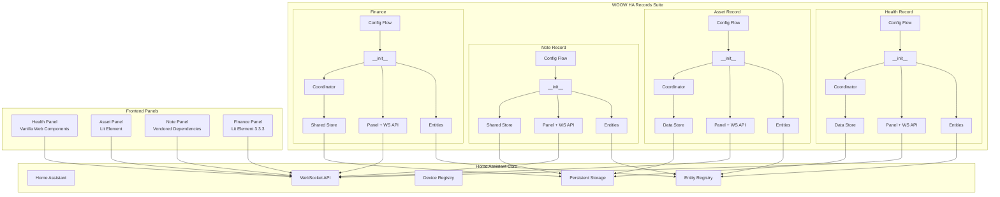
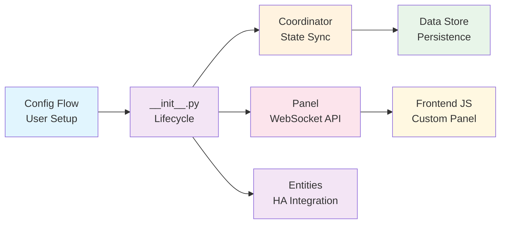
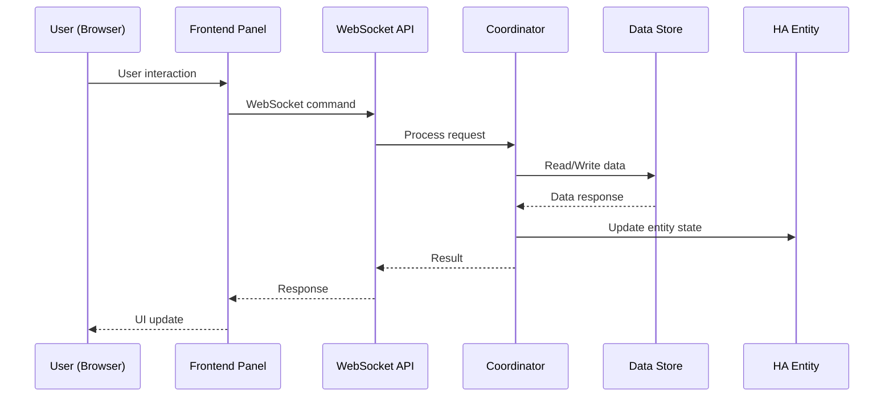

<p align="center">
  
</p>

<h1 align="center">WOOW HA Records Suite</h1>

<p align="center">
  <strong>A comprehensive Home Assistant custom component suite for personal and family record management</strong>
</p>

<p align="center">
  <a href="#overview">Overview</a> •
  <a href="#components">Components</a> •
  <a href="#architecture">Architecture</a> •
  <a href="#screenshots">Screenshots</a> •
  <a href="#installation">Installation</a> •
  <a href="#configuration">Configuration</a> •
  <a href="#testing">Testing</a> •
  <a href="#license">License</a>
</p>

<p align="center">
  
  
  
  
  
  
</p>

<p align="center">
  <a href="README_zh-TW.md">繁體中文</a>
</p>

---

## Overview

**WOOW HA Records Suite** is a collection of four custom Home Assistant components designed for comprehensive personal and family record management. All components run entirely within your Home Assistant instance — no cloud services, no external databases, no subscriptions.

### Key Features

| Feature | Description |
|---------|-------------|
| **Health Records** | Track health metrics for multiple family members with custom record types, CSV export, and trend visualization |
| **Asset Records** | Manage household assets with purchase tracking, warranty monitoring, maintenance logs, and markdown documentation |
| **Note Records** | Create and organize notes with categories, search, markdown support, and XSS-safe content handling |
| **Finance Records** | Multi-account financial tracking with recurring plans, income/expense charts, and low-balance alerts |
| **Privacy First** | All data stored locally in Home Assistant — zero cloud dependency |
| **Full Test Coverage** | 109 unit tests + 143 E2E browser tests ensure reliability |

---

## Components

### 🏥 Health Record (`ha_health_record`)

Track health metrics for multiple family members with customizable record types.

**Key Features:**
- Multi-member support (each family member as separate config entry)
- Custom record types with configurable units (e.g., weight/kg, temperature/°C)
- Quick-log buttons for rapid data entry
- CSV export for data analysis
- Config entry migration (v1 → v2)

**WebSocket API:**

| Command | Description |
|---------|-------------|
| `health_record/members` | List all members |
| `health_record/add_member` | Add a new member |
| `health_record/delete_member` | Remove a member |
| `health_record/record_types` | List record types for a member |
| `health_record/add_record_type` | Add a custom record type |
| `health_record/delete_record_type` | Remove a record type (auto-cleans entities) |
| `health_record/log` | Log a health record entry |
| `health_record/records` | Query recorded data |
| `health_record/update_record` | Update an existing record |
| `health_record/delete_record` | Delete a specific record |
| `health_record/export_csv` | Export records as CSV |

**Platforms:** Sensor, Button, Number, Text

---

### 📦 Asset Record (`ha_asset_record`)

Comprehensive household asset management with warranty tracking and maintenance documentation.

**Key Features:**
- Track purchase date, warranty expiration, brand, and category
- Monetary value tracking with decimal precision (0.01 step)
- Markdown-based manual and maintenance documentation per asset
- Category-based organization
- Orphaned device cleanup

**WebSocket API:**

| Command | Description |
|---------|-------------|
| `asset_record/list` | List all assets |
| `asset_record/add` | Add a new asset |
| `asset_record/update` | Update asset details |
| `asset_record/delete` | Remove an asset |
| `asset_record/categories` | List asset categories |
| `asset_record/search` | Search assets by keyword |

**Platforms:** Sensor, Datetime, Number, Text

---

### 📝 Note Record (`ha_note_record`)

Organize personal notes with categories, search, and rich content support.

**Key Features:**
- Category-based note organization
- Full-text search across notes
- Markdown content support
- XSS-safe content handling with sanitization
- Unicode support for multilingual content
- Vendored frontend dependencies for offline operation

**WebSocket API:**

| Command | Description |
|---------|-------------|
| `note_record/list` | List all notes |
| `note_record/add` | Create a new note |
| `note_record/update` | Update note content or title |
| `note_record/delete` | Delete a note |
| `note_record/categories` | List/manage categories |
| `note_record/search` | Search notes by keyword |

**Platforms:** Switch, Text

---

### 💰 Finance Record (`ha_finance`)

Multi-account financial tracking with recurring plans and visualization.

**Key Features:**
- Multiple financial accounts (each as separate config entry)
- Income and expense transaction logging
- Recurring plans (daily/weekly/monthly/yearly)
- Monthly income vs. expense chart data
- Low-balance alerts via HA automations
- Event-driven architecture (5 event types for automation triggers)
- Transaction history management with automatic trimming

**WebSocket API:**

| Command | Description |
|---------|-------------|
| `finance/accounts` | List all accounts |
| `finance/add_account` | Create a new account |
| `finance/delete_account` | Remove an account |
| `finance/transactions` | List transactions for an account |
| `finance/add_transaction` | Log a transaction |
| `finance/delete_transaction` | Remove a transaction |
| `finance/recurring_plans` | List recurring plans |
| `finance/add_recurring_plan` | Create a recurring plan |
| `finance/delete_recurring_plan` | Remove a recurring plan |
| `finance/chart_data` | Get monthly income/expense chart data |
| `finance/balance` | Get account balance |
| `finance/adjust_balance` | Manually adjust balance |

**Platforms:** Sensor, Button, Number

**Events:**

| Event | Description |
|-------|-------------|
| `ha_finance_transaction_added` | New transaction logged |
| `ha_finance_recurring_executed` | Recurring plan executed |
| `ha_finance_balance_adjusted` | Balance manually adjusted |
| `ha_finance_low_balance` | Balance below threshold (default: 1000 NTD) |
| `ha_finance_transactions_trimmed` | Old transactions auto-cleaned |

---

## Architecture

### System Overview



### Component Architecture Pattern

Each component follows a consistent layered architecture:



### Data Flow



---

## Screenshots

### Health Record Panel

Track health metrics for family members with custom record types and CSV export.


### Asset Record Panel

Manage household assets with purchase tracking, warranty monitoring, and documentation.


### Note Record Panel

Organize notes with categories, search, and markdown support.


### Finance Panel

Multi-account financial tracking with income/expense visualization.


### Integration Setup

Configure components through Home Assistant's standard integration flow.


---

## Installation

### HACS (Recommended)

1. Open HACS in your Home Assistant instance
2. Click the three-dot menu → **Custom repositories**
3. Add this repository URL with category **Integration**
4. Search for "WOOW HA Records" and install
5. Restart Home Assistant

### Manual Installation

1. Copy the desired component directories from `custom_components/` to your Home Assistant's `custom_components/` directory:

```
custom_components/
├── ha_health_record/
├── ha_asset_record/
├── ha_note_record/
└── ha_finance/
```

2. Restart Home Assistant

---

## Configuration

Each component is configured through the Home Assistant UI:

1. Go to **Settings** → **Devices & Services** → **Add Integration**
2. Search for the component name:
   - **Ha Health Record** — Enter member name (e.g., `baby_ming`)
   - **Asset Record** — Single instance, no additional configuration
   - **Note Record** — Enter category name
   - **Finance Record** — Enter account name and initial balance

3. The custom panel will appear in the sidebar automatically

### Multiple Entries

- **Health Record**: Add multiple members (one config entry per family member)
- **Finance**: Add multiple accounts (one config entry per financial account)
- **Note Record**: Add multiple categories
- **Asset Record**: Single instance only

---

## Testing

This project includes comprehensive test coverage with two test suites:

### Unit Tests (109 tests)

Python-based unit tests using `pytest` with Home Assistant test fixtures.

```bash
pip install -r requirements_test.txt
pytest tests/ -v
```

**Coverage:**
- Config flow validation
- Data store operations (CRUD, persistence)
- Coordinator state management
- WebSocket API handlers
- Entity platform setup
- Input validation and security checks

### E2E Browser Tests (143 tests)

TypeScript-based end-to-end tests using Playwright against a live Home Assistant instance.

```bash
cd e2e
npm install
npx playwright install
npx playwright test
```

**Test suites:**

| Suite | Tests | Description |
|-------|-------|-------------|
| `health-record.spec.ts` | 28 | Member management, record types, CRUD, CSV export, time-series |
| `asset-record.spec.ts` | 28 | Asset CRUD, categories, search, markdown, warranty tracking |
| `note-record.spec.ts` | 38 | Note CRUD, categories, search, markdown, XSS protection |
| `finance-record.spec.ts` | 38 | Account management, transactions, recurring plans, charts |
| `integration.spec.ts` | 11 | Cross-component integration and data isolation |

**Requirements:**
- Running Home Assistant instance (default: `http://localhost:18125`)
- All four components installed and configured
- Google Chrome or Chromium browser

---

## Project Structure

```
Woow_ha_records/
├── custom_components/
│   ├── ha_health_record/        # Health metrics tracking
│   │   ├── __init__.py          # Component lifecycle & multi-member setup
│   │   ├── config_flow.py       # Config entry flow
│   │   ├── coordinator.py       # Data update coordinator
│   │   ├── panel.py             # WebSocket API (12 commands)
│   │   ├── store.py             # Persistent data store
│   │   ├── sensor.py            # Sensor platform
│   │   ├── button.py            # Quick-log button platform
│   │   ├── number.py            # Number input platform
│   │   ├── text.py              # Text input platform
│   │   ├── frontend/            # Custom panel (vanilla Web Components)
│   │   └── manifest.json
│   │
│   ├── ha_asset_record/         # Asset management
│   │   ├── __init__.py          # Single-instance lifecycle
│   │   ├── config_flow.py
│   │   ├── coordinator.py
│   │   ├── panel.py             # WebSocket API + panel registration
│   │   ├── store.py
│   │   ├── sensor.py
│   │   ├── frontend/            # Custom panel (Lit Element)
│   │   └── manifest.json
│   │
│   ├── ha_note_record/          # Note management
│   │   ├── __init__.py          # Shared store architecture
│   │   ├── config_flow.py
│   │   ├── store.py
│   │   ├── websocket_api.py     # WebSocket API
│   │   ├── switch.py            # Switch platform
│   │   ├── text.py              # Text platform
│   │   ├── frontend/            # Custom panel (vendored dependencies)
│   │   │   └── vendor/          # Offline-capable third-party libs
│   │   └── manifest.json
│   │
│   └── ha_finance/              # Financial tracking
│       ├── __init__.py          # Multi-account lifecycle
│       ├── config_flow.py
│       ├── coordinator.py
│       ├── panel.py             # WebSocket API (12 commands)
│       ├── store.py
│       ├── models.py            # Data models
│       ├── frontend/            # Custom panel (Lit Element 3.3.3)
│       └── manifest.json
│
├── tests/                       # Unit tests (109 tests)
│   ├── test_health_record/
│   ├── test_asset_record/
│   ├── test_note_record/
│   └── test_finance/
│
├── e2e/                         # E2E browser tests (143 tests)
│   ├── tests/
│   ├── utils/
│   └── playwright.config.ts
│
├── docs/
│   ├── screenshots/             # Panel screenshots
│   └── PRD-e2e-browser-testing.md
│
├── hacs.json                    # HACS configuration
├── pyproject.toml               # Project configuration
├── requirements_test.txt        # Test dependencies
└── LICENSE                      # GPL-3.0
```

---

## Development

### Prerequisites

- Python 3.12+
- Home Assistant Core 2025.1+
- Node.js 18+ (for E2E tests)

### Setting Up Development Environment

```bash
# Clone the repository
git clone https://github.com/WOOWTECH/Woow_ha_records.git
cd Woow_ha_records

# Install Python test dependencies
pip install -r requirements_test.txt

# Run unit tests
pytest tests/ -v

# Install E2E test dependencies
cd e2e && npm install && npx playwright install

# Run E2E tests (requires running HA instance)
npx playwright test
```

### Component Versions

| Component | Version | Domain |
|-----------|---------|--------|
| Health Record | 1.0.0 | `ha_health_record` |
| Asset Record | 1.0.0 | `ha_asset_record` |
| Note Record | 1.0.1 | `ha_note_record` |
| Finance Record | 1.0.1 | `ha_finance` |

---

## License

This project is licensed under the [GNU General Public License v3.0](LICENSE).

---

<p align="center">
  Made with ❤️ by <a href="https://github.com/WOOWTECH">WOOWTECH</a>
</p>
