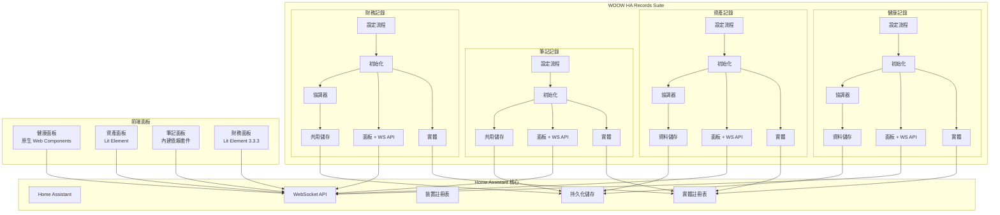
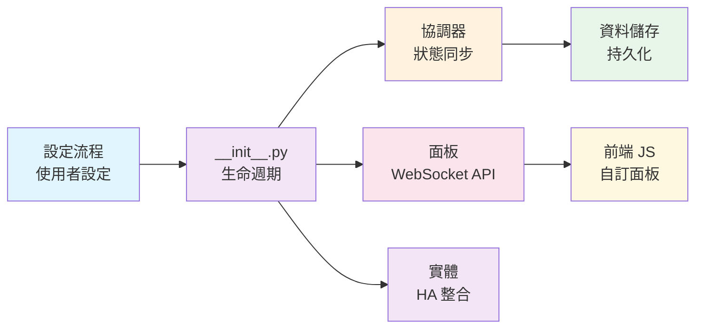
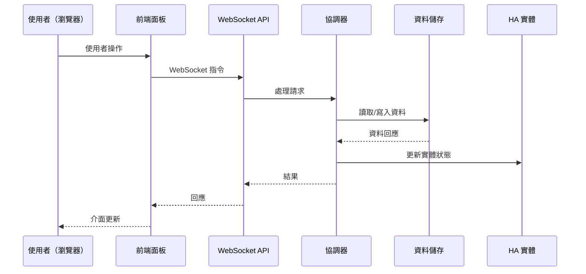

<p align="center">
  
</p>

<h1 align="center">WOOW HA Records Suite</h1>

<p align="center">
  <strong>一套完整的 Home Assistant 自訂元件套件，專為個人與家庭記錄管理而設計</strong>
</p>

<p align="center">
  <a href="#概覽">概覽</a> •
  <a href="#元件介紹">元件介紹</a> •
  <a href="#系統架構">系統架構</a> •
  <a href="#畫面截圖">畫面截圖</a> •
  <a href="#安裝方式">安裝方式</a> •
  <a href="#設定說明">設定說明</a> •
  <a href="#測試">測試</a> •
  <a href="#授權條款">授權條款</a>
</p>

<p align="center">
  
  
  
  
  
  
</p>

<p align="center">
  <a href="README.md">English</a>
</p>

---

## 概覽

**WOOW HA Records Suite** 是四個 Home Assistant 自訂元件的集合，專為全面的個人與家庭記錄管理而設計。所有元件完全在您的 Home Assistant 實例中運行 — 無需雲端服務、無需外部資料庫、無需訂閱費用。

### 核心功能

| 功能 | 說明 |
|------|------|
| **健康記錄** | 追蹤多位家庭成員的健康指標，支援自訂記錄類型、CSV 匯出及趨勢視覺化 |
| **資產記錄** | 管理家庭資產，包含購買追蹤、保固監控、維護日誌及 Markdown 文件 |
| **筆記記錄** | 建立與整理筆記，支援分類、搜尋、Markdown 及 XSS 安全內容處理 |
| **財務記錄** | 多帳戶財務追蹤，支援定期計畫、收支圖表及低餘額提醒 |
| **隱私優先** | 所有資料儲存在本地 Home Assistant — 零雲端依賴 |
| **完整測試** | 109 項單元測試 + 143 項 E2E 瀏覽器測試確保可靠性 |

---

## 元件介紹

### 🏥 健康記錄 (`ha_health_record`)

追蹤多位家庭成員的健康指標，支援自訂記錄類型。

**主要功能：**
- 多成員支援（每位家庭成員為獨立設定項目）
- 自訂記錄類型與可設定單位（例如：體重/kg、體溫/°C）
- 快速記錄按鈕，方便快速輸入資料
- CSV 匯出功能供資料分析
- 設定項目遷移（v1 → v2）

**WebSocket API：**

| 指令 | 說明 |
|------|------|
| `health_record/members` | 列出所有成員 |
| `health_record/add_member` | 新增成員 |
| `health_record/delete_member` | 移除成員 |
| `health_record/record_types` | 列出成員的記錄類型 |
| `health_record/add_record_type` | 新增自訂記錄類型 |
| `health_record/delete_record_type` | 移除記錄類型（自動清理實體） |
| `health_record/log` | 記錄健康資料 |
| `health_record/records` | 查詢已記錄的資料 |
| `health_record/update_record` | 更新已有記錄 |
| `health_record/delete_record` | 刪除特定記錄 |
| `health_record/export_csv` | 匯出記錄為 CSV |

**平台：** Sensor、Button、Number、Text

---

### 📦 資產記錄 (`ha_asset_record`)

全面的家庭資產管理，包含保固追蹤與維護文件。

**主要功能：**
- 追蹤購買日期、保固到期日、品牌及分類
- 支援小數精度的資產價值追蹤（0.01 步進）
- 每項資產的 Markdown 說明書與維護文件
- 分類管理
- 孤立裝置清理

**WebSocket API：**

| 指令 | 說明 |
|------|------|
| `asset_record/list` | 列出所有資產 |
| `asset_record/add` | 新增資產 |
| `asset_record/update` | 更新資產資料 |
| `asset_record/delete` | 移除資產 |
| `asset_record/categories` | 列出資產分類 |
| `asset_record/search` | 關鍵字搜尋資產 |

**平台：** Sensor、Datetime、Number、Text

---

### 📝 筆記記錄 (`ha_note_record`)

整理個人筆記，支援分類、搜尋及豐富內容。

**主要功能：**
- 分類式筆記組織
- 全文搜尋
- Markdown 內容支援
- XSS 安全內容處理與消毒
- Unicode 支援多語言內容
- 內建前端依賴套件，支援離線操作

**WebSocket API：**

| 指令 | 說明 |
|------|------|
| `note_record/list` | 列出所有筆記 |
| `note_record/add` | 建立新筆記 |
| `note_record/update` | 更新筆記內容或標題 |
| `note_record/delete` | 刪除筆記 |
| `note_record/categories` | 列出/管理分類 |
| `note_record/search` | 關鍵字搜尋筆記 |

**平台：** Switch、Text

---

### 💰 財務記錄 (`ha_finance`)

多帳戶財務追蹤，支援定期計畫與視覺化。

**主要功能：**
- 多財務帳戶（每個帳戶為獨立設定項目）
- 收入與支出交易記錄
- 定期計畫（每日/每週/每月/每年）
- 月度收支圖表資料
- 透過 HA 自動化實現低餘額提醒
- 事件驅動架構（5 種事件類型供自動化觸發）
- 交易歷史管理與自動修剪

**WebSocket API：**

| 指令 | 說明 |
|------|------|
| `finance/accounts` | 列出所有帳戶 |
| `finance/add_account` | 建立新帳戶 |
| `finance/delete_account` | 移除帳戶 |
| `finance/transactions` | 列出帳戶交易 |
| `finance/add_transaction` | 記錄交易 |
| `finance/delete_transaction` | 移除交易 |
| `finance/recurring_plans` | 列出定期計畫 |
| `finance/add_recurring_plan` | 建立定期計畫 |
| `finance/delete_recurring_plan` | 移除定期計畫 |
| `finance/chart_data` | 取得月度收支圖表資料 |
| `finance/balance` | 取得帳戶餘額 |
| `finance/adjust_balance` | 手動調整餘額 |

**平台：** Sensor、Button、Number

**事件：**

| 事件 | 說明 |
|------|------|
| `ha_finance_transaction_added` | 新交易已記錄 |
| `ha_finance_recurring_executed` | 定期計畫已執行 |
| `ha_finance_balance_adjusted` | 餘額已手動調整 |
| `ha_finance_low_balance` | 餘額低於閾值（預設：1000 NTD） |
| `ha_finance_transactions_trimmed` | 舊交易已自動清理 |

---

## 系統架構

### 系統總覽



### 元件架構模式

每個元件遵循一致的分層架構：



### 資料流程



---

## 畫面截圖

### 健康記錄面板

追蹤家庭成員的健康指標，支援自訂記錄類型與 CSV 匯出。


### 資產記錄面板

管理家庭資產，包含購買追蹤、保固監控及文件記錄。


### 筆記記錄面板

整理筆記，支援分類、搜尋及 Markdown。


### 財務面板

多帳戶財務追蹤，收支視覺化呈現。


### 整合設定

透過 Home Assistant 標準整合流程進行元件設定。


---

## 安裝方式

### HACS（建議方式）

1. 在 Home Assistant 中開啟 HACS
2. 點擊右上角選單 → **自訂儲存庫**
3. 加入此儲存庫 URL，類別選擇 **Integration**
4. 搜尋「WOOW HA Records」並安裝
5. 重新啟動 Home Assistant

### 手動安裝

1. 將 `custom_components/` 中所需的元件目錄複製到您的 Home Assistant 的 `custom_components/` 目錄：

```
custom_components/
├── ha_health_record/
├── ha_asset_record/
├── ha_note_record/
└── ha_finance/
```

2. 重新啟動 Home Assistant

---

## 設定說明

每個元件透過 Home Assistant UI 進行設定：

1. 前往 **設定** → **裝置與服務** → **新增整合**
2. 搜尋元件名稱：
   - **Ha Health Record** — 輸入成員名稱（例如：`baby_ming`）
   - **Asset Record** — 單一實例，無需額外設定
   - **Note Record** — 輸入分類名稱
   - **Finance Record** — 輸入帳戶名稱與初始餘額

3. 自訂面板將自動出現在側邊欄

### 多項目設定

- **健康記錄**：可新增多位成員（每位家庭成員一個設定項目）
- **財務記錄**：可新增多個帳戶（每個財務帳戶一個設定項目）
- **筆記記錄**：可新增多個分類
- **資產記錄**：僅支援單一實例

---

## 測試

本專案包含完整的測試覆蓋，共兩套測試：

### 單元測試（109 項）

使用 `pytest` 搭配 Home Assistant 測試 fixtures 的 Python 單元測試。

```bash
pip install -r requirements_test.txt
pytest tests/ -v
```

**覆蓋範圍：**
- 設定流程驗證
- 資料儲存操作（CRUD、持久化）
- 協調器狀態管理
- WebSocket API 處理器
- 實體平台設定
- 輸入驗證與安全檢查

### E2E 瀏覽器測試（143 項）

使用 Playwright 對運行中的 Home Assistant 實例進行 TypeScript 端對端測試。

```bash
cd e2e
npm install
npx playwright install
npx playwright test
```

**測試套件：**

| 套件 | 測試數 | 說明 |
|------|--------|------|
| `health-record.spec.ts` | 28 | 成員管理、記錄類型、CRUD、CSV 匯出、時間序列 |
| `asset-record.spec.ts` | 28 | 資產 CRUD、分類、搜尋、Markdown、保固追蹤 |
| `note-record.spec.ts` | 38 | 筆記 CRUD、分類、搜尋、Markdown、XSS 防護 |
| `finance-record.spec.ts` | 38 | 帳戶管理、交易、定期計畫、圖表 |
| `integration.spec.ts` | 11 | 跨元件整合與資料隔離 |

**需求：**
- 運行中的 Home Assistant 實例（預設：`http://localhost:18125`）
- 已安裝並設定四個元件
- Google Chrome 或 Chromium 瀏覽器

---

## 專案結構

```
Woow_ha_records/
├── custom_components/
│   ├── ha_health_record/        # 健康指標追蹤
│   │   ├── __init__.py          # 元件生命週期與多成員設定
│   │   ├── config_flow.py       # 設定項目流程
│   │   ├── coordinator.py       # 資料更新協調器
│   │   ├── panel.py             # WebSocket API（12 項指令）
│   │   ├── store.py             # 持久化資料儲存
│   │   ├── sensor.py            # 感測器平台
│   │   ├── button.py            # 快速記錄按鈕平台
│   │   ├── number.py            # 數值輸入平台
│   │   ├── text.py              # 文字輸入平台
│   │   ├── frontend/            # 自訂面板（原生 Web Components）
│   │   └── manifest.json
│   │
│   ├── ha_asset_record/         # 資產管理
│   │   ├── __init__.py          # 單一實例生命週期
│   │   ├── config_flow.py
│   │   ├── coordinator.py
│   │   ├── panel.py             # WebSocket API + 面板註冊
│   │   ├── store.py
│   │   ├── sensor.py
│   │   ├── frontend/            # 自訂面板（Lit Element）
│   │   └── manifest.json
│   │
│   ├── ha_note_record/          # 筆記管理
│   │   ├── __init__.py          # 共用儲存架構
│   │   ├── config_flow.py
│   │   ├── store.py
│   │   ├── websocket_api.py     # WebSocket API
│   │   ├── switch.py            # 開關平台
│   │   ├── text.py              # 文字平台
│   │   ├── frontend/            # 自訂面板（內建依賴套件）
│   │   │   └── vendor/          # 離線可用的第三方套件
│   │   └── manifest.json
│   │
│   └── ha_finance/              # 財務追蹤
│       ├── __init__.py          # 多帳戶生命週期
│       ├── config_flow.py
│       ├── coordinator.py
│       ├── panel.py             # WebSocket API（12 項指令）
│       ├── store.py
│       ├── models.py            # 資料模型
│       ├── frontend/            # 自訂面板（Lit Element 3.3.3）
│       └── manifest.json
│
├── tests/                       # 單元測試（109 項）
│   ├── test_health_record/
│   ├── test_asset_record/
│   ├── test_note_record/
│   └── test_finance/
│
├── e2e/                         # E2E 瀏覽器測試（143 項）
│   ├── tests/
│   ├── utils/
│   └── playwright.config.ts
│
├── docs/
│   ├── screenshots/             # 面板截圖
│   └── PRD-e2e-browser-testing.md
│
├── hacs.json                    # HACS 設定
├── pyproject.toml               # 專案設定
├── requirements_test.txt        # 測試依賴套件
└── LICENSE                      # GPL-3.0
```

---

## 開發

### 前置需求

- Python 3.12+
- Home Assistant Core 2025.1+
- Node.js 18+（E2E 測試用）

### 建立開發環境

```bash
# 複製儲存庫
git clone https://github.com/WOOWTECH/Woow_ha_records.git
cd Woow_ha_records

# 安裝 Python 測試依賴
pip install -r requirements_test.txt

# 執行單元測試
pytest tests/ -v

# 安裝 E2E 測試依賴
cd e2e && npm install && npx playwright install

# 執行 E2E 測試（需要運行中的 HA 實例）
npx playwright test
```

### 元件版本

| 元件 | 版本 | 網域 |
|------|------|------|
| 健康記錄 | 1.0.0 | `ha_health_record` |
| 資產記錄 | 1.0.0 | `ha_asset_record` |
| 筆記記錄 | 1.0.1 | `ha_note_record` |
| 財務記錄 | 1.0.1 | `ha_finance` |

---

## 授權條款

本專案採用 [GNU General Public License v3.0](LICENSE) 授權。

---

<p align="center">
  由 <a href="https://github.com/WOOWTECH">WOOWTECH</a> 用心打造 ❤️
</p>
