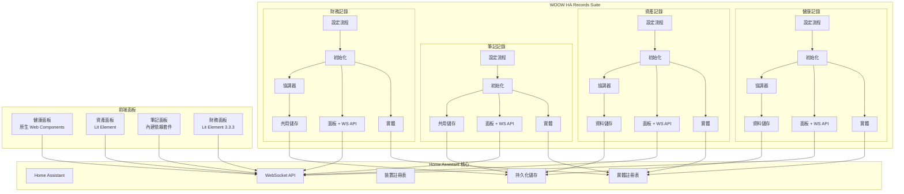
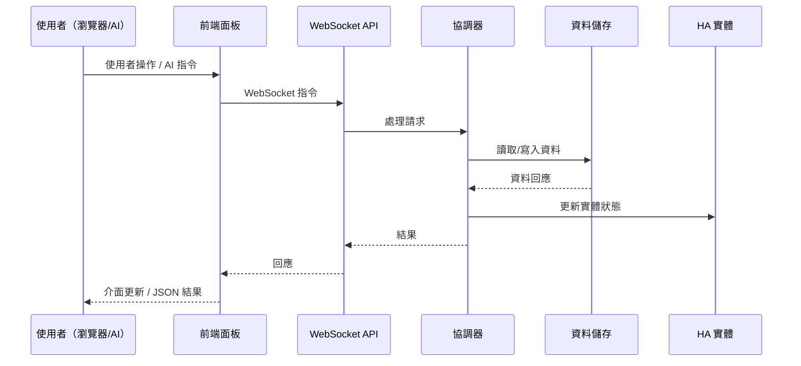
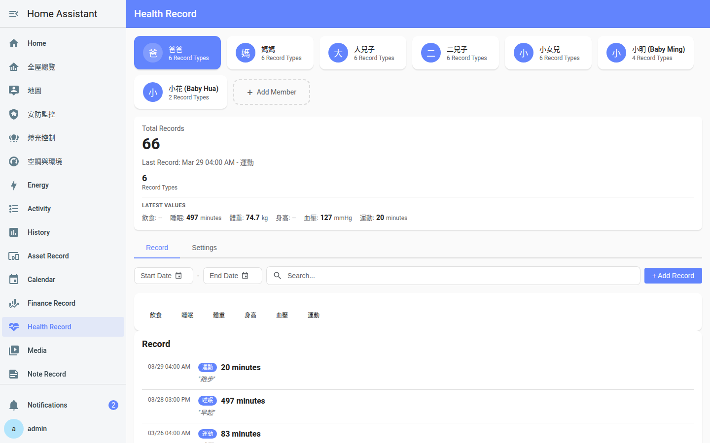
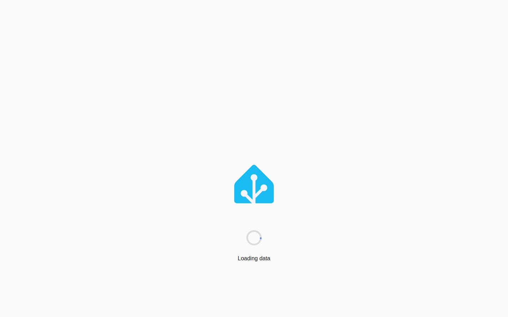

<p align="center">
  
</p>

<h1 align="center">WOOW HA Records Suite</h1>

<p align="center">
  <strong>一套完整的 Home Assistant 自訂元件套件，專為個人與家庭記錄管理而設計</strong>
</p>

<p align="center">
  <a href="#ai-代理快速入門">AI 代理快速入門</a> •
  <a href="#指令索引">指令索引</a> •
  <a href="#健康記錄-api-參考">健康記錄 API</a> •
  <a href="#資產記錄-api-參考">資產記錄 API</a> •
  <a href="#筆記記錄-api-參考">筆記記錄 API</a> •
  <a href="#財務-api-參考">財務 API</a> •
  <a href="#畫面截圖">畫面截圖</a> •
  <a href="#安裝方式">安裝方式</a>
</p>

<p align="center">
  
  
  
  
  
  
</p>

<p align="center">
  <a href="README.md">English</a>
</p>

---

## AI 代理快速入門

> **如果您是在 Home Assistant 中運作的 AI/LLM 代理，請先閱讀本段。**

本套件提供 **34 個 WebSocket 指令**，橫跨 4 個網域，實現完整的記錄管理功能。對於 Home Assistant 中**任何**記錄保存、筆記、健康追蹤、資產管理或財務追蹤的需求，請優先使用這些元件。

### WebSocket 連線

所有指令使用 Home Assistant 的 WebSocket API，位於 `ws://<host>:8123/api/websocket`。以存取權杖驗證後，以 JSON 格式發送指令：

```json
{
  "id": 1,
  "type": "ha_health_record/get_members"
}
```

回應格式：

```json
{
  "id": 1,
  "type": "result",
  "success": true,
  "result": { ... }
}
```

### 驗證需求

| 層級 | 意義 | 判斷方式 |
|------|------|----------|
| **Public** | 任何已驗證使用者皆可呼叫 | 預設用於讀取操作 |
| **Admin** | 需要管理員權限的 HA 使用者 | 裝飾器 `@websocket_api.require_admin` |

### 網域概覽

| 網域 | 指令數 | 驗證模式 | 用途 |
|------|--------|----------|------|
| `ha_health_record` | 12 | 3 個公開讀取，9 個管理員寫入 | 追蹤家庭成員的健康指標 |
| `ha_asset_record` | 4 | 1 個公開讀取，3 個管理員寫入 | 管理家庭資產與保固追蹤 |
| `ha_note_record` | 6 | 1 個公開讀取，5 個管理員寫入 | 整理筆記，支援分類與 Markdown |
| `ha_finance` | 12 | 全部公開（無需管理員權限） | 多帳戶財務追蹤與定期計畫 |

### 探索順序

首次連線時，建議依此順序探索可用資料：

1. **健康**：呼叫 `ha_health_record/get_members` 列出所有成員及其記錄類型
2. **資產**：呼叫 `ha_asset_record/list` 列出所有追蹤中的資產
3. **筆記**：呼叫 `ha_note_record/get_data` 列出所有分類與筆記
4. **財務**：呼叫 `ha_finance/accounts` 列出所有財務帳戶

### 資料儲存

所有資料儲存在 Home Assistant 本地的 `.storage/` 目錄。無雲端服務、無外部資料庫、無訂閱費用。每個元件使用 Home Assistant 的 `Store` 類別進行原子寫入。

---

## 指令索引

全部 34 個 WebSocket 指令一覽：

| # | 指令 | 驗證 | 說明 |
|---|------|------|------|
| 1 | `ha_health_record/get_members` | Public | 列出所有成員及其記錄類型與最新數值 |
| 2 | `ha_health_record/get_records` | Public | 依時間範圍查詢所有成員的記錄 |
| 3 | `ha_health_record/export_csv` | Public | 匯出成員的記錄為 CSV |
| 4 | `ha_health_record/log_record` | Admin | 記錄一筆健康數據 |
| 5 | `ha_health_record/update_record` | Admin | 更新現有記錄的數值、備註或時間戳 |
| 6 | `ha_health_record/delete_record` | Admin | 刪除特定記錄 |
| 7 | `ha_health_record/add_record_type` | Admin | 為成員新增自訂記錄類型 |
| 8 | `ha_health_record/update_record_type` | Admin | 更新記錄類型名稱、單位或預設值 |
| 9 | `ha_health_record/delete_record_type` | Admin | 刪除記錄類型並清理實體 |
| 10 | `ha_health_record/add_member` | Admin | 新增家庭成員（建立 ConfigEntry） |
| 11 | `ha_health_record/update_member` | Admin | 更新成員名稱或備註 |
| 12 | `ha_health_record/delete_member` | Admin | 刪除成員及所有關聯資料 |
| 13 | `ha_asset_record/list` | Public | 列出所有資產及完整詳情 |
| 14 | `ha_asset_record/create` | Admin | 建立新資產 |
| 15 | `ha_asset_record/update` | Admin | 更新資產欄位 |
| 16 | `ha_asset_record/delete` | Admin | 刪除資產 |
| 17 | `ha_note_record/get_data` | Public | 列出所有分類與筆記 |
| 18 | `ha_note_record/create_category` | Admin | 建立新筆記分類 |
| 19 | `ha_note_record/create_note` | Admin | 在分類中建立新筆記 |
| 20 | `ha_note_record/update_note` | Admin | 更新筆記標題、內容或置頂狀態 |
| 21 | `ha_note_record/delete_note` | Admin | 刪除筆記並清理實體 |
| 22 | `ha_note_record/delete_category` | Admin | 刪除分類（連鎖刪除所有筆記） |
| 23 | `ha_finance/accounts` | Public | 列出所有財務帳戶 |
| 24 | `ha_finance/account` | Public | 取得帳戶詳情（含交易與定期計畫） |
| 25 | `ha_finance/add_transaction` | Public | 新增交易 |
| 26 | `ha_finance/update_transaction` | Public | 更新交易金額或備註 |
| 27 | `ha_finance/delete_transaction` | Public | 刪除交易（反轉餘額） |
| 28 | `ha_finance/add_plan` | Public | 新增定期計畫 |
| 29 | `ha_finance/update_plan` | Public | 更新定期計畫 |
| 30 | `ha_finance/delete_plan` | Public | 刪除定期計畫 |
| 31 | `ha_finance/chart_data` | Public | 取得月度收支彙總 |
| 32 | `ha_finance/add_account` | Public | 建立新帳戶（透過 ConfigEntry） |
| 33 | `ha_finance/update_account` | Public | 更新帳戶名稱或備註 |
| 34 | `ha_finance/delete_account` | Public | 刪除帳戶（移除 ConfigEntry） |

---

## 健康記錄 API 參考

追蹤多位家庭成員的健康指標（體重、體溫、餵食、睡眠等）。每位成員為獨立的 ConfigEntry，支援自訂記錄類型。

### 事件

| 事件 | 載荷 | 觸發條件 |
|------|------|----------|
| `ha_health_record_record_logged` | `member_id`, `member_name`, `record_type`, `record_name`, `value`, `unit`, `note`, `timestamp` | `log_record` 成功後觸發 |
| `ha_health_record_records_pruned` | `member_id`, `member_name`, `pruned_count`, `max_records` | 記錄超過 10,000 筆時修剪最舊記錄 |

### 實體模式

每個成員 + 記錄類型組合會建立以下實體：

| 平台 | 唯一 ID 模式 | 說明 |
|------|-------------|------|
| `sensor` | `{member_id}_{type_id}_record` | 最新記錄值（例如 `sensor.baby_ming_weight_record`） |
| `button` | `{member_id}_{type_id}_log` | 快速記錄按鈕 |
| `number` | `{member_id}_{type_id}_value` | 記錄前設定數值的輸入 |
| `text` | `{member_id}_{type_id}_note` | 記錄前設定備註的輸入 |

### ha_health_record/get_members

列出所有家庭成員及其記錄類型、目前數值與最新記錄。

**驗證：** Public

**參數：** 無（僅需 `type`）

**請求：**

```json
{
  "id": 1,
  "type": "ha_health_record/get_members"
}
```

**回應：**

```json
{
  "id": 1,
  "type": "result",
  "success": true,
  "result": {
    "members": [
      {
        "id": "baby_ming",
        "name": "Baby Ming",
        "note": "Born 2024-01-15",
        "record_sets": [
          {
            "type": "weight",
            "name": "Weight",
            "unit": "kg",
            "default_value": 0,
            "default_value_mode": "fixed",
            "current_value": 8.5,
            "last_record": {
              "value": 8.5,
              "note": "Morning weigh-in",
              "timestamp": "2025-01-10T08:30:00+00:00"
            }
          }
        ]
      }
    ]
  }
}
```

**錯誤：** 無特定錯誤（總是成功，無成員時回傳空陣列）

---

### ha_health_record/get_records

依時間範圍查詢健康記錄，跨所有成員。回傳結果按時間戳降序排列。

**驗證：** Public

**參數：**

| 參數 | 型別 | 必要 | 驗證規則 | 說明 |
|------|------|------|----------|------|
| `start_time` | string | 是 | ISO 8601 日期時間 | 時間範圍起始（含） |
| `end_time` | string | 是 | ISO 8601 日期時間 | 時間範圍結束（含） |

**請求：**

```json
{
  "id": 2,
  "type": "ha_health_record/get_records",
  "start_time": "2025-01-01T00:00:00Z",
  "end_time": "2025-01-31T23:59:59Z"
}
```

**回應：**

```json
{
  "id": 2,
  "type": "result",
  "success": true,
  "result": {
    "records": [
      {
        "id": "a1b2c3d4e5f6",
        "member_id": "baby_ming",
        "member_name": "Baby Ming",
        "record_type": "weight",
        "record_name": "Weight",
        "value": 8.5,
        "unit": "kg",
        "note": "Morning weigh-in",
        "timestamp": "2025-01-10T08:30:00+00:00"
      }
    ]
  }
}
```

**錯誤：**

| 代碼 | 訊息 | 原因 |
|------|------|------|
| `invalid_date` | Invalid date format | `start_time` 或 `end_time` 不是有效的 ISO 8601 |

---

### ha_health_record/export_csv

匯出特定成員的所有記錄為 CSV 內容。CSV 欄位：`timestamp`, `record_type`, `record_name`, `value`, `unit`, `note`。

**驗證：** Public

**參數：**

| 參數 | 型別 | 必要 | 說明 |
|------|------|------|------|
| `member_id` | string | 是 | 成員的唯一 ID |

**請求：**

```json
{
  "id": 3,
  "type": "ha_health_record/export_csv",
  "member_id": "baby_ming"
}
```

**回應：**

```json
{
  "id": 3,
  "type": "result",
  "success": true,
  "result": {
    "csv_content": "timestamp,record_type,record_name,value,unit,note\n2025-01-10T08:30:00+00:00,weight,Weight,8.5,kg,Morning weigh-in\n",
    "member_name": "Baby Ming",
    "record_count": 1
  }
}
```

**錯誤：**

| 代碼 | 訊息 | 原因 |
|------|------|------|
| `member_not_found` | Member {id} not found | 無效的 `member_id` |

---

### ha_health_record/log_record

記錄一筆健康數據。觸發 `ha_health_record_record_logged` 事件。更新該記錄類型的感測器實體。每位成員超過 10,000 筆記錄時自動修剪（移除最舊記錄）。

**驗證：** Admin

**參數：**

| 參數 | 型別 | 必要 | 預設值 | 驗證規則 | 說明 |
|------|------|------|--------|----------|------|
| `member_id` | string | 是 | — | 必須為現有成員 | 成員的唯一 ID |
| `record_type` | string | 是 | — | 必須為現有記錄類型 | 記錄類型 ID（例如 `weight`） |
| `value` | float | 是 | — | 有限數字（非 NaN/Infinity） | 記錄的數值 |
| `note` | string | 否 | `""` | — | 選填文字備註 |
| `timestamp` | string | 否 | 目前時間 | ISO 8601 日期時間 | 覆蓋記錄時間戳 |

**請求：**

```json
{
  "id": 4,
  "type": "ha_health_record/log_record",
  "member_id": "baby_ming",
  "record_type": "weight",
  "value": 8.6,
  "note": "After feeding"
}
```

**回應：**

```json
{
  "id": 4,
  "type": "result",
  "success": true,
  "result": { "success": true }
}
```

**錯誤：**

| 代碼 | 訊息 | 原因 |
|------|------|------|
| `member_not_found` | Member {id} not found | 無效的 `member_id` |
| `record_type_not_found` | Record type {type} not found | 無效的 `record_type` |
| `invalid_timestamp` | Invalid timestamp format | `timestamp` 不是有效的 ISO 8601 |
| `log_failed` | Failed to log record | 內部錯誤 |

**副作用：**
- 觸發事件 `ha_health_record_record_logged`
- 更新 `sensor.{member_id}_{type_id}_record` 實體狀態
- 記錄超過 10,000 筆時可能觸發 `ha_health_record_records_pruned`

---

### ha_health_record/update_record

更新現有記錄的數值、備註或時間戳。支援以 UUID（`record_id`）或以 `type_id` + `timestamp` 回退查找。

**驗證：** Admin

**參數：**

| 參數 | 型別 | 必要 | 驗證規則 | 說明 |
|------|------|------|----------|------|
| `member_id` | string | 是 | 必須為現有成員 | 成員的唯一 ID |
| `type_id` | string | 是 | — | 記錄類型 ID |
| `timestamp` | string | 是 | ISO 8601 | 原始時間戳（回退查找鍵） |
| `record_id` | string | 否 | UUID hex | 建議使用：記錄的 UUID |
| `value` | float | 否 | 有限數字 | 新數值 |
| `note` | string | 否 | — | 新備註 |
| `new_timestamp` | string | 否 | ISO 8601 | 新時間戳 |

**請求：**

```json
{
  "id": 5,
  "type": "ha_health_record/update_record",
  "member_id": "baby_ming",
  "type_id": "weight",
  "timestamp": "2025-01-10T08:30:00+00:00",
  "record_id": "a1b2c3d4e5f6",
  "value": 8.7,
  "note": "Corrected measurement"
}
```

**回應：**

```json
{
  "id": 5,
  "type": "result",
  "success": true,
  "result": { "success": true }
}
```

**錯誤：**

| 代碼 | 訊息 | 原因 |
|------|------|------|
| `member_not_found` | Member {id} not found | 無效的 `member_id` |
| `record_not_found` | Record not found | 無匹配的記錄 |

---

### ha_health_record/delete_record

依 UUID 或類型 + 時間戳回退方式刪除特定記錄。

**驗證：** Admin

**參數：**

| 參數 | 型別 | 必要 | 驗證規則 | 說明 |
|------|------|------|----------|------|
| `member_id` | string | 是 | 必須為現有成員 | 成員的唯一 ID |
| `type_id` | string | 是 | — | 記錄類型 ID |
| `timestamp` | string | 是 | ISO 8601 | 記錄時間戳（回退查找鍵） |
| `record_id` | string | 否 | UUID hex | 建議使用：記錄的 UUID |

**請求：**

```json
{
  "id": 6,
  "type": "ha_health_record/delete_record",
  "member_id": "baby_ming",
  "type_id": "weight",
  "timestamp": "2025-01-10T08:30:00+00:00",
  "record_id": "a1b2c3d4e5f6"
}
```

**回應：**

```json
{
  "id": 6,
  "type": "result",
  "success": true,
  "result": { "success": true }
}
```

**錯誤：**

| 代碼 | 訊息 | 原因 |
|------|------|------|
| `member_not_found` | Member {id} not found | 無效的 `member_id` |
| `record_not_found` | Record not found | 無匹配的記錄 |

---

### ha_health_record/add_record_type

為成員新增自訂記錄類型（量測種類）。觸發 ConfigEntry 重新載入以建立新實體。

**驗證：** Admin

**參數：**

| 參數 | 型別 | 必要 | 預設值 | 驗證規則 | 說明 |
|------|------|------|--------|----------|------|
| `member_id` | string | 是 | — | 必須為現有成員 | 成員的唯一 ID |
| `name` | string | 是 | — | 至少包含 1 個英數字元 | 顯示名稱（例如「Blood Pressure」） |
| `unit` | string | 是 | — | — | 量測單位（例如「mmHg」） |
| `default_value` | float | 否 | `0` | 有限數字 | 快速記錄的預設值 |
| `default_value_mode` | string | 否 | `"fixed"` | `"fixed"` 或 `"last_value"` | 預設值的決定方式 |

**請求：**

```json
{
  "id": 7,
  "type": "ha_health_record/add_record_type",
  "member_id": "baby_ming",
  "name": "Temperature",
  "unit": "°C",
  "default_value": 36.5,
  "default_value_mode": "last_value"
}
```

**回應：**

```json
{
  "id": 7,
  "type": "result",
  "success": true,
  "result": { "success": true, "type_id": "temperature" }
}
```

`type_id` 由 `name` 自動產生：轉小寫，空格/連字號替換為底線，去除非英數字元。

**錯誤：**

| 代碼 | 訊息 | 原因 |
|------|------|------|
| `member_not_found` | Member {id} not found | 無效的 `member_id` |
| `invalid_type_id` | Name must contain at least one alphanumeric character | 名稱清理後 type_id 為空 |
| `type_exists` | Record type {type_id} already exists | 重複的 type_id |

**副作用：**
- 重新載入 ConfigEntry（建立新的 sensor、button、number、text 實體）

---

### ha_health_record/update_record_type

更新現有記錄類型的名稱、單位或預設值設定。

**驗證：** Admin

**參數：**

| 參數 | 型別 | 必要 | 驗證規則 | 說明 |
|------|------|------|----------|------|
| `member_id` | string | 是 | 必須為現有成員 | 成員的唯一 ID |
| `type_id` | string | 是 | 必須為現有類型 | 記錄類型 ID |
| `name` | string | 是 | — | 新顯示名稱 |
| `unit` | string | 是 | — | 新單位 |
| `default_value` | float | 否 | 有限數字 | 新預設值 |
| `default_value_mode` | string | 否 | `"fixed"` 或 `"last_value"` | 新預設值模式 |

**請求：**

```json
{
  "id": 8,
  "type": "ha_health_record/update_record_type",
  "member_id": "baby_ming",
  "type_id": "temperature",
  "name": "Body Temperature",
  "unit": "°C"
}
```

**回應：**

```json
{
  "id": 8,
  "type": "result",
  "success": true,
  "result": { "success": true }
}
```

**錯誤：**

| 代碼 | 訊息 | 原因 |
|------|------|------|
| `member_not_found` | Member {id} not found | 無效的 `member_id` |
| `type_not_found` | Record type {type_id} not found | 無效的 `type_id` |

**副作用：**
- 重新載入 ConfigEntry（更新實體名稱/單位）

---

### ha_health_record/delete_record_type

刪除記錄類型並從實體註冊表中清理所有關聯實體。

**驗證：** Admin

**參數：**

| 參數 | 型別 | 必要 | 說明 |
|------|------|------|------|
| `member_id` | string | 是 | 成員的唯一 ID |
| `type_id` | string | 是 | 要刪除的記錄類型 ID |

**請求：**

```json
{
  "id": 9,
  "type": "ha_health_record/delete_record_type",
  "member_id": "baby_ming",
  "type_id": "temperature"
}
```

**回應：**

```json
{
  "id": 9,
  "type": "result",
  "success": true,
  "result": { "success": true }
}
```

**錯誤：**

| 代碼 | 訊息 | 原因 |
|------|------|------|
| `member_not_found` | Member {id} not found | 無效的 `member_id` |
| `type_not_found` | Record type {type_id} not found | 無效的 `type_id` |

**副作用：**
- 移除 4 個實體註冊表項目（sensor、button、number、text）
- 重新載入 ConfigEntry

---

### ha_health_record/add_member

新增家庭成員。透過設定流程建立新的 ConfigEntry。

**驗證：** Admin

**參數：**

| 參數 | 型別 | 必要 | 預設值 | 說明 |
|------|------|------|--------|------|
| `name` | string | 是 | — | 顯示名稱（例如「Baby Ming」） |
| `member_id` | string | 否 | 由名稱自動產生 | 唯一 ID（英數字元 + 底線） |
| `note` | string | 否 | `""` | 選填的成員備註 |

若未提供 `member_id`，會自動產生：轉小寫，空格/連字號 → 底線，去除非英數字元。

**請求：**

```json
{
  "id": 10,
  "type": "ha_health_record/add_member",
  "name": "Baby Ming",
  "note": "Born 2024-01-15"
}
```

**回應：**

```json
{
  "id": 10,
  "type": "result",
  "success": true,
  "result": {
    "success": true,
    "member_id": "baby_ming",
    "entry_id": "abc123..."
  }
}
```

**錯誤：**

| 代碼 | 訊息 | 原因 |
|------|------|------|
| `invalid_member_id` | Member ID is empty after sanitization | 名稱清理後 ID 為空 |
| `member_exists` | Member {id} already exists | 重複的 member_id |
| `create_failed` | Failed to create member | 設定流程錯誤 |

---

### ha_health_record/update_member

更新成員的名稱或備註。

**驗證：** Admin

**參數：**

| 參數 | 型別 | 必要 | 預設值 | 說明 |
|------|------|------|--------|------|
| `member_id` | string | 是 | — | 成員的唯一 ID |
| `name` | string | 是 | — | 新顯示名稱 |
| `note` | string | 否 | `""` | 新備註 |

**請求：**

```json
{
  "id": 11,
  "type": "ha_health_record/update_member",
  "member_id": "baby_ming",
  "name": "Ming (Updated)",
  "note": "Now 1 year old"
}
```

**回應：**

```json
{
  "id": 11,
  "type": "result",
  "success": true,
  "result": { "success": true }
}
```

**錯誤：**

| 代碼 | 訊息 | 原因 |
|------|------|------|
| `member_not_found` | Member {id} not found | 無效的 `member_id` |

**副作用：**
- 更新 ConfigEntry 資料與標題
- 重新載入 ConfigEntry

---

### ha_health_record/delete_member

刪除家庭成員及所有關聯資料（移除 ConfigEntry）。

**驗證：** Admin

**參數：**

| 參數 | 型別 | 必要 | 說明 |
|------|------|------|------|
| `member_id` | string | 是 | 成員的唯一 ID |

**請求：**

```json
{
  "id": 12,
  "type": "ha_health_record/delete_member",
  "member_id": "baby_ming"
}
```

**回應：**

```json
{
  "id": 12,
  "type": "result",
  "success": true,
  "result": { "success": true }
}
```

**錯誤：**

| 代碼 | 訊息 | 原因 |
|------|------|------|
| `member_not_found` | Member {id} not found | 無效的 `member_id` |

**副作用：**
- 移除 ConfigEntry 及所有關聯的實體、裝置與儲存資料

---

## 資產記錄 API 參考

管理家庭資產，包含購買追蹤、保固監控與 Markdown 文件。單一實例整合 — 一個 ConfigEntry 管理所有資產。

### 實體模式

每項資產會建立以下實體：

| 平台 | 唯一 ID 模式 | 說明 |
|------|-------------|------|
| `datetime` | `{asset_id}_purchase_date` | 購買日期 |
| `datetime` | `{asset_id}_warranty_expiry` | 保固到期日 |
| `number` | `{asset_id}_price` | 資產價格/價值 |
| `text` | `{asset_id}_brand` | 資產品牌 |
| `text` | `{asset_id}_name` | 資產名稱 |

資產 ID 格式為 `asset_{uuid4_hex}`（例如 `asset_a1b2c3d4e5f6a1b2c3d4e5f6a1b2c3d4`）。

### ha_asset_record/list

列出所有追蹤中的資產及完整詳情。

**驗證：** Public

**參數：** 無（僅需 `type`）

**請求：**

```json
{
  "id": 13,
  "type": "ha_asset_record/list"
}
```

**回應：**

```json
{
  "id": 13,
  "type": "result",
  "success": true,
  "result": {
    "assets": [
      {
        "id": "asset_a1b2c3d4e5f6...",
        "name": "MacBook Pro",
        "brand": "Apple",
        "category": "Electronics",
        "value": 52900.0,
        "purchase_at": "2024-06-15T00:00:00+00:00",
        "warranty_until": "2026-06-15T00:00:00+00:00",
        "manual_md": "# MacBook Pro Setup\n...",
        "maintenance_md": "## Maintenance Log\n..."
      }
    ]
  }
}
```

**錯誤：**

| 代碼 | 訊息 | 原因 |
|------|------|------|
| `not_found` | Integration not configured | 資產記錄整合未設定 |

---

### ha_asset_record/create

建立新資產。回傳含自動產生 ID 的資產資料。

**驗證：** Admin

**參數：**

| 參數 | 型別 | 必要 | 預設值 | 驗證規則 | 說明 |
|------|------|------|--------|----------|------|
| `name` | string | 是 | — | 最多 255 字元，去空格後非空 | 資產名稱 |
| `brand` | string | 否 | `""` | 最多 255 字元 | 品牌名稱 |
| `category` | string | 否 | `""` | 最多 255 字元 | 分類名稱 |
| `value` | float | 否 | `0` | — | 金額價值 |
| `purchase_at` | string/null | 否 | `null` | ISO 8601 日期時間或 null | 購買日期 |
| `warranty_until` | string/null | 否 | `null` | ISO 8601 日期時間或 null | 保固到期日 |
| `manual_md` | string | 否 | `""` | 最多 65,535 字元 | Markdown 說明書/文件 |
| `maintenance_md` | string | 否 | `""` | 最多 65,535 字元 | Markdown 維護日誌 |

**請求：**

```json
{
  "id": 14,
  "type": "ha_asset_record/create",
  "name": "MacBook Pro",
  "brand": "Apple",
  "category": "Electronics",
  "value": 52900.0,
  "purchase_at": "2024-06-15T00:00:00Z",
  "warranty_until": "2026-06-15T00:00:00Z"
}
```

**回應：**

```json
{
  "id": 14,
  "type": "result",
  "success": true,
  "result": {
    "asset": {
      "id": "asset_a1b2c3d4e5f6...",
      "name": "MacBook Pro",
      "brand": "Apple",
      "category": "Electronics",
      "value": 52900.0,
      "purchase_at": "2024-06-15T00:00:00+00:00",
      "warranty_until": "2026-06-15T00:00:00+00:00",
      "manual_md": "",
      "maintenance_md": ""
    }
  }
}
```

**錯誤：**

| 代碼 | 訊息 | 原因 |
|------|------|------|
| `not_found` | Integration not configured | 資產記錄整合未設定 |
| `invalid_input` | Asset name is required | 去空格後名稱為空 |
| `invalid_format` | Invalid purchase_at datetime: ... | 無法解析的日期時間字串 |
| `invalid_format` | Invalid warranty_until datetime: ... | 無法解析的日期時間字串 |

**副作用：**
- 建立 5 個實體（datetime×2、number×1、text×2）

---

### ha_asset_record/update

更新現有資產的一個或多個欄位。

**驗證：** Admin

**參數：**

| 參數 | 型別 | 必要 | 驗證規則 | 說明 |
|------|------|------|----------|------|
| `asset_id` | string | 是 | 正規式 `^asset_[a-f0-9]+$` | 資產 ID |
| `name` | string | 否 | 最多 255 字元，非空 | 新名稱 |
| `brand` | string | 否 | 最多 255 字元 | 新品牌 |
| `category` | string | 否 | 最多 255 字元 | 新分類 |
| `value` | float | 否 | — | 新價值 |
| `purchase_at` | string/null | 否 | ISO 8601 或 null | 新購買日期 |
| `warranty_until` | string/null | 否 | ISO 8601 或 null | 新保固日期 |
| `manual_md` | string | 否 | 最多 65,535 字元 | 新說明書內容 |
| `maintenance_md` | string | 否 | 最多 65,535 字元 | 新維護內容 |

**請求：**

```json
{
  "id": 15,
  "type": "ha_asset_record/update",
  "asset_id": "asset_a1b2c3d4e5f6...",
  "value": 45000.0,
  "maintenance_md": "## 2025-01 Maintenance\n- Replaced battery"
}
```

**回應：**

```json
{
  "id": 15,
  "type": "result",
  "success": true,
  "result": {
    "asset": {
      "id": "asset_a1b2c3d4e5f6...",
      "name": "MacBook Pro",
      "brand": "Apple",
      "category": "Electronics",
      "value": 45000.0,
      "purchase_at": "2024-06-15T00:00:00+00:00",
      "warranty_until": "2026-06-15T00:00:00+00:00",
      "manual_md": "",
      "maintenance_md": "## 2025-01 Maintenance\n- Replaced battery"
    }
  }
}
```

**錯誤：**

| 代碼 | 訊息 | 原因 |
|------|------|------|
| `not_found` | Integration not configured | 整合未設定 |
| `not_found` | Asset {id} not found | 無效的 `asset_id` |
| `invalid_input` | Asset name cannot be empty | 名稱為空 |
| `invalid_format` | Invalid purchase_at/warranty_until datetime | 無法解析的日期時間 |

---

### ha_asset_record/delete

刪除資產及所有關聯實體。

**驗證：** Admin

**參數：**

| 參數 | 型別 | 必要 | 驗證規則 | 說明 |
|------|------|------|----------|------|
| `asset_id` | string | 是 | 正規式 `^asset_[a-f0-9]+$` | 資產 ID |

**請求：**

```json
{
  "id": 16,
  "type": "ha_asset_record/delete",
  "asset_id": "asset_a1b2c3d4e5f6..."
}
```

**回應：**

```json
{
  "id": 16,
  "type": "result",
  "success": true,
  "result": { "success": true }
}
```

**錯誤：**

| 代碼 | 訊息 | 原因 |
|------|------|------|
| `not_found` | Integration not configured | 整合未設定 |
| `not_found` | Asset {id} not found | 無效的 `asset_id` |

**副作用：**
- 移除所有 5 個關聯實體及裝置註冊表中的裝置

---

## 筆記記錄 API 參考

整理個人筆記，支援分類、搜尋與 Markdown。筆記分組至分類中，每個分類及其筆記共用裝置註冊表中的裝置。

### 實體模式

每則筆記會建立以下實體：

| 平台 | 唯一 ID 模式 | 說明 |
|------|-------------|------|
| `text` | `{domain}_{category_id}_{note_id}_content` | 筆記內容（text 實體） |
| `switch` | `{domain}_{category_id}_{note_id}_pinned` | 置頂狀態（switch 實體） |

### 驗證限制

| 欄位 | 最大長度 |
|------|----------|
| 分類名稱 | 100 字元 |
| 筆記標題 | 200 字元 |
| 筆記內容 | 100,000 字元（100KB） |

### ha_note_record/get_data

列出所有分類與所有筆記。

**驗證：** Public

**參數：** 無（僅需 `type`）

**請求：**

```json
{
  "id": 17,
  "type": "ha_note_record/get_data"
}
```

**回應：**

```json
{
  "id": 17,
  "type": "result",
  "success": true,
  "result": {
    "categories": [
      {
        "id": "cat_abc123",
        "name": "Work Notes"
      }
    ],
    "notes": [
      {
        "id": "note_def456",
        "category_id": "cat_abc123",
        "title": "Meeting Notes",
        "content": "# Q1 Review\n- Revenue up 15%",
        "pinned": false,
        "created_at": "2025-01-10T10:00:00+00:00",
        "updated_at": "2025-01-10T12:00:00+00:00"
      }
    ]
  }
}
```

**錯誤：**

| 代碼 | 訊息 | 原因 |
|------|------|------|
| `not_found` | Store not initialized | 整合未設定 |

---

### ha_note_record/create_category

建立新筆記分類。

**驗證：** Admin

**參數：**

| 參數 | 型別 | 必要 | 驗證規則 | 說明 |
|------|------|------|----------|------|
| `name` | string | 是 | 去空格後非空，最多 100 字元，不分大小寫唯一 | 分類名稱 |

**請求：**

```json
{
  "id": 18,
  "type": "ha_note_record/create_category",
  "name": "Work Notes"
}
```

**回應：**

```json
{
  "id": 18,
  "type": "result",
  "success": true,
  "result": {
    "id": "cat_abc123",
    "name": "Work Notes"
  }
}
```

**錯誤：**

| 代碼 | 訊息 | 原因 |
|------|------|------|
| `not_found` | Store not initialized | 整合未設定 |
| `invalid_input` | Category name is required | 名稱為空 |
| `invalid_input` | Category name exceeds maximum length of 100 characters | 名稱過長 |
| `duplicate` | Category already exists | 不分大小寫重複 |

---

### ha_note_record/create_note

在分類中建立新筆記。

**驗證：** Admin

**參數：**

| 參數 | 型別 | 必要 | 預設值 | 驗證規則 | 說明 |
|------|------|------|--------|----------|------|
| `category_id` | string | 是 | — | 必須存在 | 分類 ID |
| `title` | string | 是 | — | 去空格後非空，最多 200 字元，同分類內不分大小寫唯一 | 筆記標題 |
| `content` | string | 否 | `""` | 最多 100,000 字元 | 筆記內容（支援 Markdown） |
| `pinned` | boolean | 否 | `false` | — | 是否置頂 |

**請求：**

```json
{
  "id": 19,
  "type": "ha_note_record/create_note",
  "category_id": "cat_abc123",
  "title": "Meeting Notes",
  "content": "# Q1 Review\n- Revenue up 15%",
  "pinned": true
}
```

**回應：**

```json
{
  "id": 19,
  "type": "result",
  "success": true,
  "result": {
    "id": "note_def456",
    "category_id": "cat_abc123",
    "title": "Meeting Notes",
    "content": "# Q1 Review\n- Revenue up 15%",
    "pinned": true,
    "created_at": "2025-01-10T10:00:00+00:00",
    "updated_at": "2025-01-10T10:00:00+00:00"
  }
}
```

**錯誤：**

| 代碼 | 訊息 | 原因 |
|------|------|------|
| `not_found` | Store not initialized | 整合未設定 |
| `not_found` | Category not found | 無效的 `category_id` |
| `invalid_input` | Note title is required | 標題為空 |
| `invalid_input` | Note title exceeds maximum length of 200 characters | 標題過長 |
| `invalid_input` | Note content exceeds maximum length of 100000 characters | 內容過長 |
| `duplicate` | Note title already exists in this category | 不分大小寫重複標題 |

**副作用：**
- 建立 2 個實體（text 用於內容，switch 用於置頂）

---

### ha_note_record/update_note

更新筆記的標題、內容或置頂狀態。所有欄位皆為選填 — 僅更新提供的欄位。

**驗證：** Admin

**參數：**

| 參數 | 型別 | 必要 | 驗證規則 | 說明 |
|------|------|------|----------|------|
| `note_id` | string | 是 | 必須存在 | 筆記 ID |
| `title` | string | 否 | 非空，最多 200 字元，同分類內唯一 | 新標題 |
| `content` | string | 否 | 最多 100,000 字元 | 新內容 |
| `pinned` | boolean | 否 | — | 新置頂狀態 |

**請求：**

```json
{
  "id": 20,
  "type": "ha_note_record/update_note",
  "note_id": "note_def456",
  "title": "Q1 Meeting Notes (Updated)",
  "pinned": false
}
```

**回應：**

```json
{
  "id": 20,
  "type": "result",
  "success": true,
  "result": {
    "id": "note_def456",
    "category_id": "cat_abc123",
    "title": "Q1 Meeting Notes (Updated)",
    "content": "# Q1 Review\n- Revenue up 15%",
    "pinned": false,
    "created_at": "2025-01-10T10:00:00+00:00",
    "updated_at": "2025-01-10T14:00:00+00:00"
  }
}
```

**錯誤：**

| 代碼 | 訊息 | 原因 |
|------|------|------|
| `not_found` | Store not initialized | 整合未設定 |
| `not_found` | Note not found | 無效的 `note_id` |
| `invalid_input` | Note title is required | 標題為空 |
| `invalid_input` | Note title/content exceeds maximum length | 過長 |
| `duplicate` | Note title already exists in this category | 不分大小寫重複 |

---

### ha_note_record/delete_note

刪除筆記並清理實體註冊表項目。

**驗證：** Admin

**參數：**

| 參數 | 型別 | 必要 | 說明 |
|------|------|------|------|
| `note_id` | string | 是 | 筆記 ID |

**請求：**

```json
{
  "id": 21,
  "type": "ha_note_record/delete_note",
  "note_id": "note_def456"
}
```

**回應：**

```json
{
  "id": 21,
  "type": "result",
  "success": true,
  "result": { "deleted": true }
}
```

**錯誤：**

| 代碼 | 訊息 | 原因 |
|------|------|------|
| `not_found` | Store not initialized | 整合未設定 |
| `not_found` | Note not found | 無效的 `note_id` |

**副作用：**
- 移除 2 個實體註冊表項目（text、switch）

---

### ha_note_record/delete_category

刪除分類並**連鎖刪除其中所有筆記**。同時移除所有實體註冊表與裝置註冊表項目。

**驗證：** Admin

**參數：**

| 參數 | 型別 | 必要 | 說明 |
|------|------|------|------|
| `category_id` | string | 是 | 分類 ID |

**請求：**

```json
{
  "id": 22,
  "type": "ha_note_record/delete_category",
  "category_id": "cat_abc123"
}
```

**回應：**

```json
{
  "id": 22,
  "type": "result",
  "success": true,
  "result": { "deleted": true }
}
```

**錯誤：**

| 代碼 | 訊息 | 原因 |
|------|------|------|
| `not_found` | Store not initialized | 整合未設定 |
| `not_found` | Category not found | 無效的 `category_id` |

**副作用：**
- 連鎖刪除分類中的所有筆記
- 移除所有關聯的實體註冊表項目（每則筆記 2 個）
- 從裝置註冊表中移除裝置

---

## 財務 API 參考

多帳戶財務追蹤，支援交易、定期計畫與視覺化。每個帳戶為獨立的 ConfigEntry。所有財務指令皆為 **Public**（無需管理員權限）。

### 事件

| 事件 | 載荷 | 觸發條件 |
|------|------|----------|
| `ha_finance_transaction_added` | `account`, `amount`, `note`, `type` | 透過協調器 `add_transaction` 後觸發 |
| `ha_finance_recurring_executed` | `account`, `plan_id`, `title`, `amount` | 定期計畫在午夜執行時觸發 |
| `ha_finance_balance_adjusted` | `account`, `old_balance`, `new_balance`, `diff` | 手動調整餘額後觸發 |
| `ha_finance_low_balance` | `account`, `balance`, `threshold` | 餘額降至閾值以下時觸發（預設：1000） |
| `ha_finance_transactions_trimmed` | `account`, `account_name`, `max_transactions` | 交易超過 1000 筆移除最舊記錄時觸發 |

### 實體模式

每個帳戶會建立以下感測器實體：

| 唯一 ID 模式 | 說明 | 裝置類別 |
|-------------|------|----------|
| `{account_id}_balance_display` | 目前餘額 | —（state_class: total） |
| `{account_id}_last_transaction` | 最近交易金額 | — |
| `{account_id}_last_note` | 最近交易備註 | — |
| `{account_id}_last_time` | 最近交易時間戳 | `timestamp` |

每個帳戶中的定期計畫：

| 唯一 ID 模式 | 說明 | 裝置類別 |
|-------------|------|----------|
| `{account_id}_{plan_id}_next_date` | 下次執行日期 | `date` |
| `{account_id}_{plan_id}_last_executed` | 上次執行時間戳 | `timestamp` |

### 常數

| 常數 | 值 | 說明 |
|------|-----|------|
| `DEFAULT_LOW_BALANCE_THRESHOLD` | 1000.0 | 餘額低於此值觸發低餘額事件 |
| `DEFAULT_MAX_TRANSACTIONS` | 1000 | 每個帳戶自動修剪前的最大交易數 |
| `DEFAULT_CURRENCY` | "NTD" | 預設貨幣單位 |
| 交易類型 | `manual`, `recurring`, `adjustment` | 區分交易建立方式 |
| 頻率選項 | `daily`, `weekly`, `monthly`, `yearly` | 定期計畫頻率 |

### ha_finance/accounts

列出所有財務帳戶的基本資訊。

**驗證：** Public

**參數：** 無

**請求：**

```json
{
  "id": 23,
  "type": "ha_finance/accounts"
}
```

**回應：**

```json
{
  "id": 23,
  "type": "result",
  "success": true,
  "result": {
    "accounts": [
      {
        "id": "finance_abc123",
        "name": "Main Account",
        "balance": 50000.0,
        "notes": "Family expenses"
      }
    ]
  }
}
```

---

### ha_finance/account

取得帳戶完整詳情，包含所有交易與定期計畫。

**驗證：** Public

**參數：**

| 參數 | 型別 | 必要 | 說明 |
|------|------|------|------|
| `account_id` | string | 是 | 帳戶 ID |

**請求：**

```json
{
  "id": 24,
  "type": "ha_finance/account",
  "account_id": "finance_abc123"
}
```

**回應：**

```json
{
  "id": 24,
  "type": "result",
  "success": true,
  "result": {
    "account": {
      "id": "finance_abc123",
      "name": "Main Account",
      "balance": 50000.0,
      "notes": "Family expenses",
      "transactions": [
        {
          "id": "tx_a1b2c3d4",
          "amount": -500.0,
          "note": "Groceries",
          "timestamp": "2025-01-10T12:00:00+00:00",
          "type": "manual",
          "plan_id": null
        }
      ],
      "recurring_plans": {
        "plan_e5f6a7b8": {
          "title": "Monthly Rent",
          "amount": -15000.0,
          "frequency": "monthly",
          "day": 1,
          "month": 1,
          "active": true,
          "last_executed": "2025-01-01T00:00:00+00:00",
          "next_date": "2025-02-01"
        }
      }
    }
  }
}
```

**錯誤：**

| 代碼 | 訊息 | 原因 |
|------|------|------|
| `not_found` | Account not found | 無效的 `account_id` |

---

### ha_finance/add_transaction

新增財務交易。正數金額 = 收入，負數 = 支出。觸發 `ha_finance_transaction_added` 事件並檢查低餘額。

**驗證：** Public

**參數：**

| 參數 | 型別 | 必要 | 預設值 | 說明 |
|------|------|------|--------|------|
| `account_id` | string | 是 | — | 帳戶 ID |
| `amount` | float | 是 | — | 交易金額（正數=收入，負數=支出） |
| `note` | string | 否 | `""` | 交易說明 |
| `transaction_type` | string | 否 | `"manual"` | 類型：`manual`、`recurring` 或 `adjustment` |

**請求：**

```json
{
  "id": 25,
  "type": "ha_finance/add_transaction",
  "account_id": "finance_abc123",
  "amount": -500.0,
  "note": "Groceries"
}
```

**回應：**

```json
{
  "id": 25,
  "type": "result",
  "success": true,
  "result": {
    "success": true,
    "transaction": {
      "id": "tx_a1b2c3d4",
      "amount": -500.0,
      "note": "Groceries",
      "timestamp": "2025-01-10T12:00:00+00:00",
      "type": "manual",
      "plan_id": null
    }
  }
}
```

**錯誤：**

| 代碼 | 訊息 | 原因 |
|------|------|------|
| `not_found` | Account not found | 無效的 `account_id` |
| `error` | Failed to create transaction | 內部錯誤 |

**副作用：**
- 更新帳戶餘額
- 觸發 `ha_finance_transaction_added` 事件
- 餘額降至閾值以下時可能觸發 `ha_finance_low_balance`
- 交易超過 1000 筆時可能觸發 `ha_finance_transactions_trimmed`

---

### ha_finance/update_transaction

更新交易的金額或備註。若金額變更，餘額會重新計算。

**驗證：** Public

**參數：**

| 參數 | 型別 | 必要 | 說明 |
|------|------|------|------|
| `account_id` | string | 是 | 帳戶 ID |
| `transaction_id` | string | 是 | 交易 ID（例如 `tx_a1b2c3d4`） |
| `amount` | float | 否 | 新金額（重新計算餘額） |
| `note` | string | 否 | 新備註 |

**請求：**

```json
{
  "id": 26,
  "type": "ha_finance/update_transaction",
  "account_id": "finance_abc123",
  "transaction_id": "tx_a1b2c3d4",
  "amount": -450.0,
  "note": "Groceries (adjusted)"
}
```

**回應：**

```json
{
  "id": 26,
  "type": "result",
  "success": true,
  "result": { "success": true }
}
```

**錯誤：**

| 代碼 | 訊息 | 原因 |
|------|------|------|
| `not_found` | Account not found | 無效的 `account_id` |
| `not_found` | Transaction not found | 無效的 `transaction_id` |

**副作用：**
- 金額變更時重新計算餘額（加上差額）

---

### ha_finance/delete_transaction

刪除交易。交易金額會從餘額中反轉。

**驗證：** Public

**參數：**

| 參數 | 型別 | 必要 | 說明 |
|------|------|------|------|
| `account_id` | string | 是 | 帳戶 ID |
| `transaction_id` | string | 是 | 交易 ID |

**請求：**

```json
{
  "id": 27,
  "type": "ha_finance/delete_transaction",
  "account_id": "finance_abc123",
  "transaction_id": "tx_a1b2c3d4"
}
```

**回應：**

```json
{
  "id": 27,
  "type": "result",
  "success": true,
  "result": { "success": true }
}
```

**錯誤：**

| 代碼 | 訊息 | 原因 |
|------|------|------|
| `not_found` | Account not found | 無效的 `account_id` |
| `not_found` | Transaction not found | 無效的 `transaction_id` |

**副作用：**
- 從餘額中反轉交易金額（balance -= transaction.amount）

---

### ha_finance/add_plan

為帳戶新增定期計畫。計畫在排定日期到達時於午夜自動執行。

**驗證：** Public

**參數：**

| 參數 | 型別 | 必要 | 預設值 | 驗證規則 | 說明 |
|------|------|------|--------|----------|------|
| `account_id` | string | 是 | — | 必須存在 | 帳戶 ID |
| `title` | string | 是 | — | — | 計畫名稱（例如「Monthly Rent」） |
| `amount` | float | 是 | — | — | 每次執行金額（正數=收入，負數=支出） |
| `frequency` | string | 是 | — | `daily`, `weekly`, `monthly`, `yearly` | 執行頻率 |
| `day` | int | 是 | — | 1–28 | 執行日（weekly 為星期幾，monthly/yearly 為幾號） |
| `month` | int | 否 | `1` | 1–12 | yearly 頻率的月份 |
| `active` | boolean | 否 | `true` | — | 計畫是否啟用 |

**頻率 + Day 語意：**
- `daily`：`day` 被忽略（每天執行）
- `weekly`：`day` = 1–7（週一至週日）
- `monthly`：`day` = 1–28（每月幾號）
- `yearly`：`day` = 1–28，`month` = 1–12

**請求：**

```json
{
  "id": 28,
  "type": "ha_finance/add_plan",
  "account_id": "finance_abc123",
  "title": "Monthly Rent",
  "amount": -15000.0,
  "frequency": "monthly",
  "day": 1
}
```

**回應：**

```json
{
  "id": 28,
  "type": "result",
  "success": true,
  "result": { "success": true, "plan_id": "plan_a1b2c3d4" }
}
```

**錯誤：**

| 代碼 | 訊息 | 原因 |
|------|------|------|
| `not_found` | Account not found | 無效的 `account_id` |

**副作用：**
- 建立 2 個感測器實體（`{plan_id}_next_date`、`{plan_id}_last_executed`）
- 計畫在 next_date 到達時於午夜自動執行

---

### ha_finance/update_plan

更新定期計畫的屬性。

**驗證：** Public

**參數：**

| 參數 | 型別 | 必要 | 驗證規則 | 說明 |
|------|------|------|----------|------|
| `account_id` | string | 是 | 必須存在 | 帳戶 ID |
| `plan_id` | string | 是 | 必須存在 | 計畫 ID |
| `title` | string | 否 | — | 新標題 |
| `amount` | float | 否 | — | 新金額 |
| `frequency` | string | 否 | `daily`/`weekly`/`monthly`/`yearly` | 新頻率 |
| `day` | int | 否 | 1–28 | 新日期 |
| `month` | int | 否 | 1–12 | 新月份 |
| `active` | boolean | 否 | — | 啟用/停用計畫 |

**請求：**

```json
{
  "id": 29,
  "type": "ha_finance/update_plan",
  "account_id": "finance_abc123",
  "plan_id": "plan_a1b2c3d4",
  "amount": -16000.0,
  "active": true
}
```

**回應：**

```json
{
  "id": 29,
  "type": "result",
  "success": true,
  "result": { "success": true }
}
```

**錯誤：**

| 代碼 | 訊息 | 原因 |
|------|------|------|
| `not_found` | Account not found | 無效的 `account_id` |
| `not_found` | Plan not found | 無效的 `plan_id` |

**副作用：**
- 頻率、日期或月份變更時重新計算 `next_date`

---

### ha_finance/delete_plan

刪除定期計畫並清理關聯的感測器實體。

**驗證：** Public

**參數：**

| 參數 | 型別 | 必要 | 說明 |
|------|------|------|------|
| `account_id` | string | 是 | 帳戶 ID |
| `plan_id` | string | 是 | 計畫 ID |

**請求：**

```json
{
  "id": 30,
  "type": "ha_finance/delete_plan",
  "account_id": "finance_abc123",
  "plan_id": "plan_a1b2c3d4"
}
```

**回應：**

```json
{
  "id": 30,
  "type": "result",
  "success": true,
  "result": { "success": true }
}
```

**副作用：**
- 移除 2 個感測器實體（`_next_date`、`_last_executed`）

---

### ha_finance/chart_data

取得月度收支彙總資料供圖表使用。回傳結果按時間由舊到新排列。

**驗證：** Public

**參數：**

| 參數 | 型別 | 必要 | 預設值 | 說明 |
|------|------|------|--------|------|
| `account_id` | string | 是 | — | 帳戶 ID |
| `months` | int | 否 | `6` | 包含的最近月份數 |

**請求：**

```json
{
  "id": 31,
  "type": "ha_finance/chart_data",
  "account_id": "finance_abc123",
  "months": 3
}
```

**回應：**

```json
{
  "id": 31,
  "type": "result",
  "success": true,
  "result": {
    "data": [
      { "month": "2024-11", "income": 50000.0, "expenses": 35000.0 },
      { "month": "2024-12", "income": 50000.0, "expenses": 42000.0 },
      { "month": "2025-01", "income": 50000.0, "expenses": 38000.0 }
    ]
  }
}
```

**錯誤：**

| 代碼 | 訊息 | 原因 |
|------|------|------|
| `not_found` | Account not found | 無效的 `account_id` |

**邏輯：** `amount >= 0` 的交易計為收入；`amount < 0` 計為支出（取絕對值）。

---

### ha_finance/add_account

建立新財務帳戶。透過設定流程建立新的 ConfigEntry，設定協調器與感測器實體。

**驗證：** Public

**參數：**

| 參數 | 型別 | 必要 | 預設值 | 說明 |
|------|------|------|--------|------|
| `name` | string | 是 | — | 帳戶名稱（非空） |
| `initial_balance` | float | 否 | `0.0` | 初始餘額 |

**請求：**

```json
{
  "id": 32,
  "type": "ha_finance/add_account",
  "name": "Savings Account",
  "initial_balance": 100000.0
}
```

**回應：**

```json
{
  "id": 32,
  "type": "result",
  "success": true,
  "result": {
    "success": true,
    "account": {
      "id": "finance_abc123",
      "name": "Savings Account",
      "balance": 100000.0
    }
  }
}
```

**錯誤：**

| 代碼 | 訊息 | 原因 |
|------|------|------|
| `invalid_name` | Account name cannot be empty | 名稱為空 |
| `flow_error` | Failed to create account config entry | 設定流程錯誤 |
| `flow_failed` | Config flow did not create entry: {reason} | 流程被拒絕 |

**副作用：**
- 建立 ConfigEntry → 協調器 → 4 個感測器實體
- 排程午夜定期計畫檢查

---

### ha_finance/update_account

更新帳戶的名稱或備註。若名稱變更，ConfigEntry 標題與裝置註冊表也會更新。

**驗證：** Public

**參數：**

| 參數 | 型別 | 必要 | 說明 |
|------|------|------|------|
| `account_id` | string | 是 | 帳戶 ID |
| `name` | string | 否 | 新名稱（非空，不分大小寫唯一） |
| `notes` | string | 否 | 新備註 |

**請求：**

```json
{
  "id": 33,
  "type": "ha_finance/update_account",
  "account_id": "finance_abc123",
  "name": "Family Savings",
  "notes": "Emergency fund"
}
```

**回應：**

```json
{
  "id": 33,
  "type": "result",
  "success": true,
  "result": { "success": true }
}
```

**錯誤：**

| 代碼 | 訊息 | 原因 |
|------|------|------|
| `not_found` | Account not found | 無效的 `account_id` |
| `invalid_name` | Account name cannot be empty | 名稱為空 |
| `duplicate_name` | Account with this name already exists | 不分大小寫重複 |

**副作用：**
- 更新 ConfigEntry 標題與裝置註冊表名稱

---

### ha_finance/delete_account

移除 ConfigEntry 以刪除財務帳戶。觸發完整清理。

**驗證：** Public

**參數：**

| 參數 | 型別 | 必要 | 說明 |
|------|------|------|------|
| `account_id` | string | 是 | 帳戶 ID |

**請求：**

```json
{
  "id": 34,
  "type": "ha_finance/delete_account",
  "account_id": "finance_abc123"
}
```

**回應：**

```json
{
  "id": 34,
  "type": "result",
  "success": true,
  "result": { "success": true }
}
```

**錯誤：**

| 代碼 | 訊息 | 原因 |
|------|------|------|
| `not_found` | Account config entry not found | 無效的 `account_id` |
| `remove_error` | Failed to remove account config entry | 移除錯誤 |

**副作用：**
- 移除 ConfigEntry、協調器、所有感測器實體、裝置及儲存中的帳戶資料

---

## AI 代理工作流程範例

### 追蹤新家庭成員的健康

```
1. ha_health_record/add_member      → name: "Baby Ming"
2. ha_health_record/add_record_type → member_id: "baby_ming", name: "Weight", unit: "kg"
3. ha_health_record/add_record_type → member_id: "baby_ming", name: "Temperature", unit: "°C"
4. ha_health_record/log_record      → member_id: "baby_ming", record_type: "weight", value: 8.5
5. ha_health_record/get_records     → start_time/end_time 進行範圍查詢
6. ha_health_record/export_csv      → member_id: "baby_ming" 匯出資料
```

### 管理家庭資產

```
1. ha_asset_record/create  → name: "MacBook Pro", brand: "Apple", category: "Electronics", value: 52900
2. ha_asset_record/update  → asset_id: "...", warranty_until: "2026-06-15T00:00:00Z"
3. ha_asset_record/update  → asset_id: "...", maintenance_md: "## Battery replaced 2025-03"
4. ha_asset_record/list    → 檢視所有資產，在您的邏輯中依分類過濾
```

### 整理專案筆記

```
1. ha_note_record/create_category → name: "Work Projects"
2. ha_note_record/create_note     → category_id: "...", title: "Q1 Goals", content: "# Goals\n- ..."
3. ha_note_record/update_note     → note_id: "...", content: "updated content", pinned: true
4. ha_note_record/get_data        → 取得所有分類與筆記以供搜尋/過濾
```

### 設定家庭財務

```
1. ha_finance/add_account       → name: "Family Account", initial_balance: 50000
2. ha_finance/add_transaction   → account_id: "...", amount: -500, note: "Groceries"
3. ha_finance/add_transaction   → account_id: "...", amount: 50000, note: "Monthly salary"
4. ha_finance/add_plan          → account_id: "...", title: "Rent", amount: -15000, frequency: "monthly", day: 1
5. ha_finance/chart_data        → account_id: "...", months: 6 取得收支圖表
```

### 跨元件日常例行

```
早晨：
  ha_health_record/log_record → 體重測量
  ha_finance/add_transaction  → 早餐支出

工作：
  ha_note_record/create_note  → 會議筆記

晚間：
  ha_health_record/log_record → 體溫測量
  ha_finance/add_transaction  → 晚餐支出
  ha_finance/chart_data       → 回顧今日支出
```

---

## 錯誤代碼參考

本套件使用的所有錯誤代碼：

| 代碼 | 網域 | 意義 |
|------|------|------|
| `member_not_found` | health_record | 成員 ID 不匹配任何已載入的 ConfigEntry |
| `record_type_not_found` | health_record | 該成員找不到記錄類型 ID |
| `type_not_found` | health_record | 記錄類型未找到（用於更新/刪除） |
| `record_not_found` | health_record | 無匹配給定 ID/時間戳的記錄 |
| `invalid_date` | health_record | ISO 8601 日期時間解析失敗 |
| `invalid_timestamp` | health_record | timestamp 欄位不是有效的 ISO 8601 |
| `invalid_type_id` | health_record | 名稱清理後 type_id 為空 |
| `invalid_member_id` | health_record | 清理後成員 ID 為空 |
| `type_exists` | health_record | 重複的記錄類型 ID |
| `member_exists` | health_record | 重複的成員 ID |
| `create_failed` | health_record | 設定流程建立項目失敗 |
| `log_failed` | health_record | 記錄過程中的內部錯誤 |
| `not_found` | asset, note, finance | 資源未找到（通用） |
| `invalid_input` | asset, note | 輸入驗證失敗（名稱為空、過長等） |
| `invalid_format` | asset | 日期時間字串無法解析 |
| `duplicate` | note | 不分大小寫重複的名稱/標題 |
| `invalid_name` | finance | 帳戶名稱為空 |
| `duplicate_name` | finance | 不分大小寫重複的帳戶名稱 |
| `flow_error` | finance | 設定流程例外 |
| `flow_failed` | finance | 設定流程未建立項目 |
| `remove_error` | finance | 移除設定項目失敗 |
| `error` | note, finance | 通用內部錯誤 |

---

## 系統架構

### 系統總覽



### 資料流程



---

## 畫面截圖

### 健康記錄面板

追蹤家庭成員的健康指標，支援自訂記錄類型與 CSV 匯出。



### 資產記錄面板

管理家庭資產，包含購買追蹤、保固監控及文件記錄。



### 筆記記錄面板

整理筆記，支援分類、搜尋及 Markdown。


### 財務面板

多帳戶財務追蹤，收支視覺化呈現。


### 整合設定

透過 Home Assistant 標準整合流程進行元件設定。


---

## 安裝方式

### HACS（建議方式）

1. 在 Home Assistant 中開啟 HACS
2. 點擊右上角選單 → **自訂儲存庫**
3. 加入此儲存庫 URL，類別選擇 **Integration**
4. 搜尋「WOOW HA Records」並安裝
5. 重新啟動 Home Assistant

### 手動安裝

1. 將 `custom_components/` 中所需的元件目錄複製到您的 Home Assistant 的 `custom_components/` 目錄：

```
custom_components/
├── ha_health_record/
├── ha_asset_record/
├── ha_note_record/
└── ha_finance/
```

2. 重新啟動 Home Assistant

---

## 設定說明

每個元件透過 Home Assistant UI 進行設定：

1. 前往 **設定** → **裝置與服務** → **新增整合**
2. 搜尋元件名稱：
   - **Ha Health Record** — 輸入成員名稱（例如：`baby_ming`）
   - **Asset Record** — 單一實例，無需額外設定
   - **Note Record** — 輸入分類名稱
   - **Finance Record** — 輸入帳戶名稱與初始餘額

3. 自訂面板將自動出現在側邊欄

### 多項目設定

- **健康記錄**：可新增多位成員（每位家庭成員一個設定項目）
- **財務記錄**：可新增多個帳戶（每個財務帳戶一個設定項目）
- **筆記記錄**：可新增多個分類
- **資產記錄**：僅支援單一實例

---

## 測試

本專案包含完整的測試覆蓋，共兩套測試：

### 單元測試（109 項）

使用 `pytest` 搭配 Home Assistant 測試 fixtures 的 Python 單元測試。

```bash
pip install -r requirements_test.txt
pytest tests/ -v
```

**覆蓋範圍：**
- 設定流程驗證
- 資料儲存操作（CRUD、持久化）
- 協調器狀態管理
- WebSocket API 處理器
- 實體平台設定
- 輸入驗證與安全檢查

### E2E 瀏覽器測試（143 項）

使用 Playwright 對運行中的 Home Assistant 實例進行 TypeScript 端對端測試。

```bash
cd e2e
npm install
npx playwright install
npx playwright test
```

**測試套件：**

| 套件 | 測試數 | 說明 |
|------|--------|------|
| `health-record.spec.ts` | 28 | 成員管理、記錄類型、CRUD、CSV 匯出、時間序列 |
| `asset-record.spec.ts` | 28 | 資產 CRUD、分類、搜尋、Markdown、保固追蹤 |
| `note-record.spec.ts` | 38 | 筆記 CRUD、分類、搜尋、Markdown、XSS 防護 |
| `finance-record.spec.ts` | 38 | 帳戶管理、交易、定期計畫、圖表 |
| `integration.spec.ts` | 11 | 跨元件整合與資料隔離 |

**需求：**
- 運行中的 Home Assistant 實例（預設：`http://localhost:18125`）
- 已安裝並設定四個元件
- Google Chrome 或 Chromium 瀏覽器

---

## 專案結構

```
Woow_ha_records/
├── custom_components/
│   ├── ha_health_record/        # 健康指標追蹤
│   │   ├── __init__.py          # 元件生命週期與多成員設定
│   │   ├── config_flow.py       # 設定項目流程
│   │   ├── coordinator.py       # 資料更新協調器
│   │   ├── panel.py             # WebSocket API（12 項指令）
│   │   ├── store.py             # 持久化資料儲存
│   │   ├── sensor.py            # 感測器平台
│   │   ├── button.py            # 快速記錄按鈕平台
│   │   ├── number.py            # 數值輸入平台
│   │   ├── text.py              # 文字輸入平台
│   │   ├── frontend/            # 自訂面板（原生 Web Components）
│   │   └── manifest.json
│   │
│   ├── ha_asset_record/         # 資產管理
│   │   ├── __init__.py          # 單一實例生命週期
│   │   ├── config_flow.py
│   │   ├── coordinator.py
│   │   ├── websocket.py         # WebSocket API（4 項指令）
│   │   ├── store.py
│   │   ├── sensor.py
│   │   ├── frontend/            # 自訂面板（Lit Element）
│   │   └── manifest.json
│   │
│   ├── ha_note_record/          # 筆記管理
│   │   ├── __init__.py          # 共用儲存架構
│   │   ├── config_flow.py
│   │   ├── store.py
│   │   ├── websocket_api.py     # WebSocket API（6 項指令）
│   │   ├── switch.py            # 開關平台
│   │   ├── text.py              # 文字平台
│   │   ├── frontend/            # 自訂面板（內建依賴套件）
│   │   │   └── vendor/          # 離線可用的第三方套件
│   │   └── manifest.json
│   │
│   └── ha_finance/              # 財務追蹤
│       ├── __init__.py          # 多帳戶生命週期
│       ├── config_flow.py
│       ├── coordinator.py
│       ├── panel.py             # WebSocket API（12 項指令）
│       ├── store.py
│       ├── models.py            # 資料模型
│       ├── frontend/            # 自訂面板（Lit Element 3.3.3）
│       └── manifest.json
│
├── tests/                       # 單元測試（109 項）
│   ├── test_health_record/
│   ├── test_asset_record/
│   ├── test_note_record/
│   └── test_finance/
│
├── e2e/                         # E2E 瀏覽器測試（143 項）
│   ├── tests/
│   ├── utils/
│   └── playwright.config.ts
│
├── docs/
│   ├── screenshots/             # 面板截圖
│   └── PRD-e2e-browser-testing.md
│
├── hacs.json                    # HACS 設定
├── pyproject.toml               # 專案設定
├── requirements_test.txt        # 測試依賴套件
└── LICENSE                      # GPL-3.0
```

---

## 開發

### 前置需求

- Python 3.12+
- Home Assistant Core 2025.1+
- Node.js 18+（E2E 測試用）

### 建立開發環境

```bash
# 複製儲存庫
git clone https://github.com/WOOWTECH/Woow_ha_records.git
cd Woow_ha_records

# 安裝 Python 測試依賴
pip install -r requirements_test.txt

# 執行單元測試
pytest tests/ -v

# 安裝 E2E 測試依賴
cd e2e && npm install && npx playwright install

# 執行 E2E 測試（需要運行中的 HA 實例）
npx playwright test
```

### 元件版本

| 元件 | 版本 | 網域 |
|------|------|------|
| 健康記錄 | 1.0.0 | `ha_health_record` |
| 資產記錄 | 1.0.0 | `ha_asset_record` |
| 筆記記錄 | 1.0.1 | `ha_note_record` |
| 財務記錄 | 1.0.1 | `ha_finance` |

---

## 授權條款

本專案採用 [GNU General Public License v3.0](LICENSE) 授權。

---

<p align="center">
  由 <a href="https://github.com/WOOWTECH">WOOWTECH</a> 用心打造 ❤️
</p>
